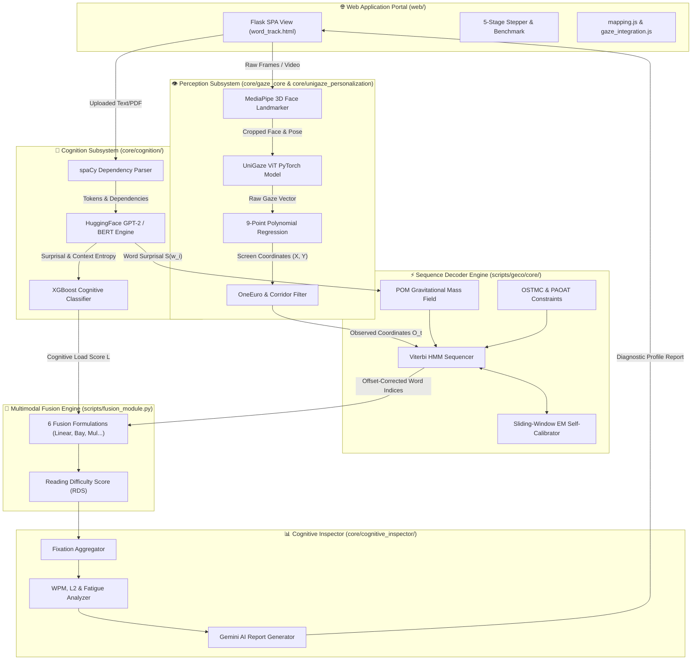
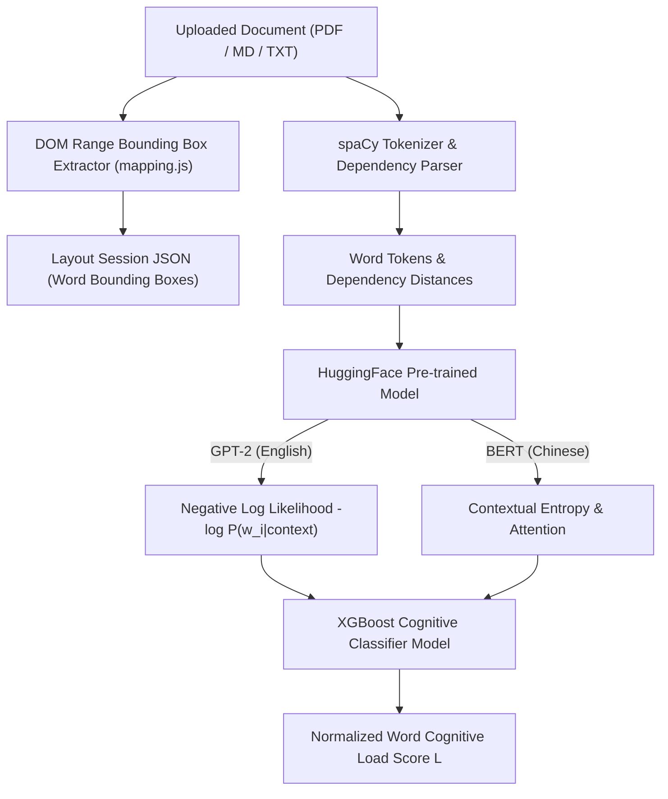
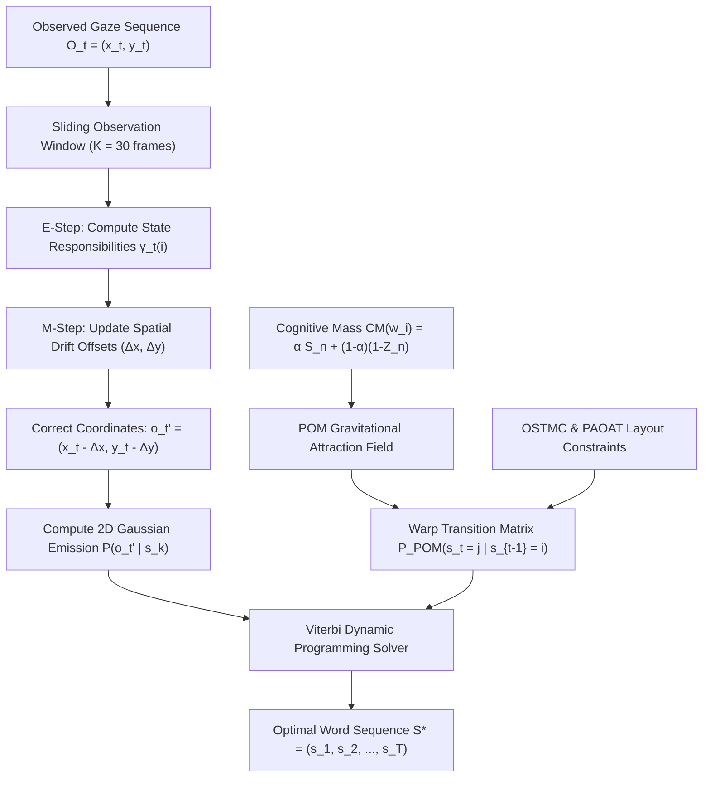
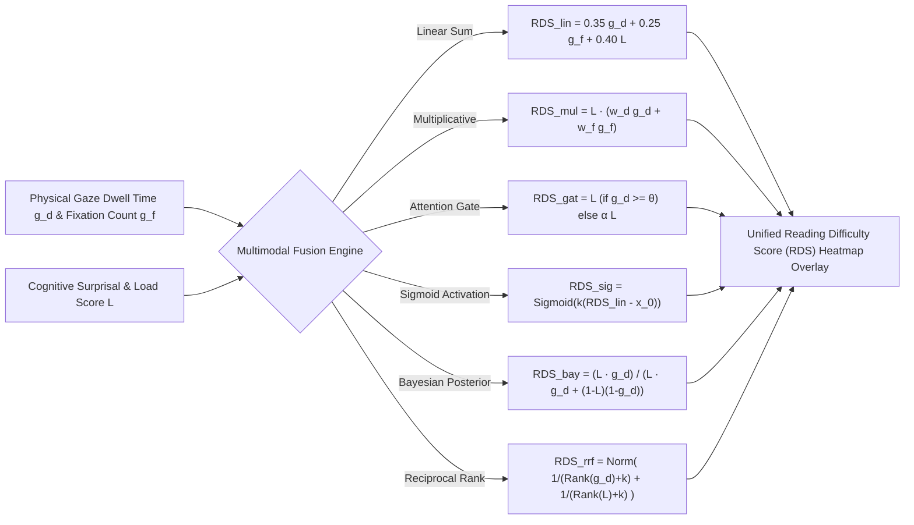
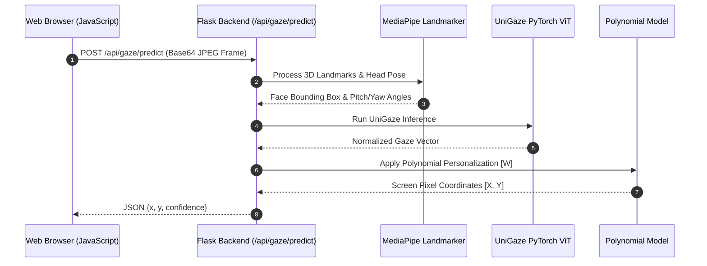
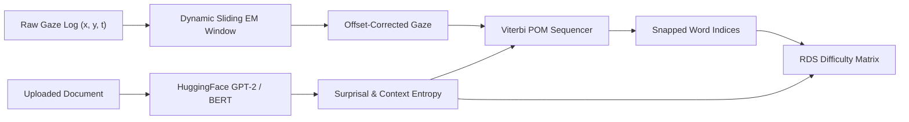
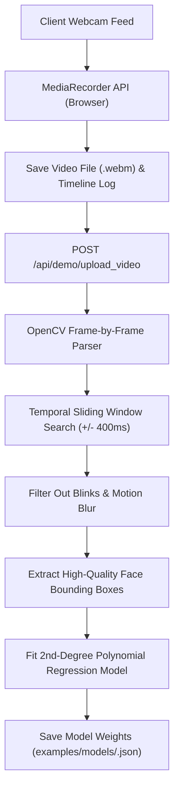
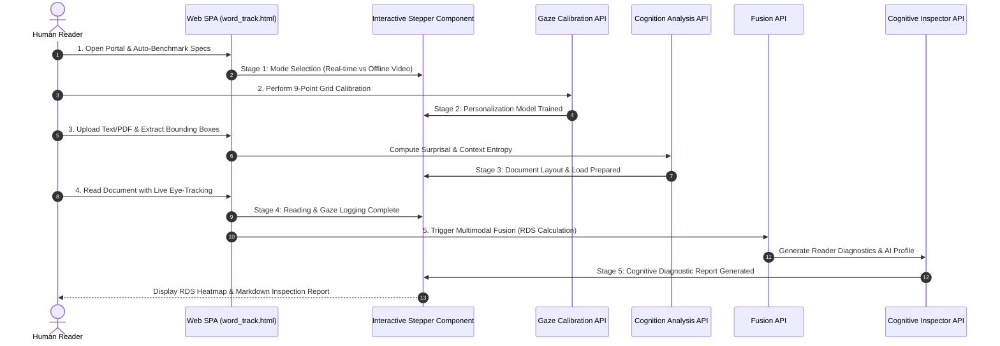

# 📖 LexiGaze: Complete & Comprehensive System Documentation

> **Latest Version Specification & Technical Architecture Reference**  
> *Platform for Multimodal Eye-Gaze Tracking, Psycholinguistic Cognitive Load Modeling, and Spatio-Temporal Sequence Fusion.*

---

## 📋 Table of Contents

1. [Executive Summary & Core Value Proposition](#1-executive-summary--core-value-proposition)
2. [System Architecture & Subsystem Specification](#2-system-architecture--subsystem-specification)
   - [2.1 High-Level Architecture Flowcharts](#21-high-level-architecture-flowcharts)
   - [2.2 Perception Module (`core/gaze_core/` & `core/unigaze_personalization/`)](#22-perception-module-coregaze_core--coreunigaze_personalization)
   - [2.3 Cognition Module (`core/cognition/`)](#23-cognition-module-corecognition)
   - [2.4 Sequence Decoder Engine (STOCK-T / `scripts/geco/core/`)](#24-sequence-decoder-engine-stock-t--scriptsgecocore)
   - [2.5 Multimodal Fusion Engine (`scripts/fusion_module.py`)](#25-multimodal-fusion-engine-scriptsfusion_modulepy)
   - [2.6 Cognitive Inspector & Diagnostic Analyzer (`core/cognitive_inspector/`)](#26-cognitive-inspector--diagnostic-analyzer-corecognitive_inspector)
   - [2.7 Web Application Framework (`web/`)](#27-web-application-framework-web)
3. [Mathematical & Algorithmic Foundations](#3-mathematical--algorithmic-foundations)
   - [3.1 Hidden Markov Model (HMM) Viterbi Sequence Decoding](#31-hidden-markov-model-hmm-viterbi-sequence-decoding)
   - [3.2 Expectation-Maximization (EM) Dynamic Offset Calibration](#32-expectation-maximization-em-dynamic-offset-calibration)
   - [3.3 Psycholinguistic Oculomotor Model (POM) & Cognitive Mass Field](#33-psycholinguistic-oculomotor-model-pom--cognitive-mass-field)
   - [3.4 Oculomotor Layout Constraints (OSTMC & PAOAT)](#34-oculomotor-layout-constraints-ostmc--paoat)
   - [3.5 Six Multimodal Fusion Formulations](#35-six-multimodal-fusion-formulations)
   - [3.6 Diagnostic Profiling Formulation](#36-diagnostic-profiling-formulation)
4. [Data Flow & End-to-End Operational Pipelines](#4-data-flow--end-to-end-operational-pipelines)
   - [4.1 Real-Time Webcam Eye-Tracking Pipeline](#41-real-time-webcam-eye-tracking-pipeline)
   - [4.2 Document Parsing & DOM Coordinate Layout Extraction](#42-document-parsing--dom-coordinate-layout-extraction)
   - [4.3 Joint Perception-Cognition Fusion Flow](#43-joint-perception-cognition-fusion-flow)
   - [4.4 Video-Based Offline Processing & Autotraining Pipeline](#44-video-based-offline-processing--autotraining-pipeline)
   - [4.5 Interactive Stepper & Web SPA Workflow](#45-interactive-stepper--web-spa-workflow)
   - [4.6 Cross-Platform Remote Tunneling & Data Collection](#46-cross-platform-remote-tunneling--data-collection)
5. [Database, Manifest & File Schemas](#5-database-manifest--file-schemas)
   - [5.1 Calibration Session Manifest (`manifest.jsonl`)](#51-calibration-session-manifest-manifestjsonl)
   - [5.2 Personalization Model Configuration (`<model_name>.json`)](#52-personalization-model-configuration-model_namejson)
   - [5.3 Document Coordinate Layout Specification (`<session_id>.json`)](#53-document-coordinate-layout-specification-session_idjson)
   - [5.4 Fused Reading Difficulty Dataset Schema (`fused_rds_dataset.csv`)](#54-fused-reading-difficulty-dataset-schema-fused_rds_datasetcsv)
6. [Empirical Benchmarks & Experimental Results](#6-empirical-benchmarks--experimental-results)
   - [6.1 GECO Benchmark System Performance Evaluation](#61-geco-benchmark-system-performance-evaluation)
   - [6.2 Comparative Accuracy Breakdown under Extreme Drift](#62-comparative-accuracy-breakdown-under-extreme-drift)
   - [6.3 Multimodal Fusion Evaluation on Human Reading Time (TRT)](#63-multimodal-fusion-evaluation-on-human-reading-time-trt)
   - [6.4 Preregistered Cross-Subject and Cross-Trial Generalization](#64-preregistered-cross-subject-and-cross-trial-generalization)
   - [6.5 Frozen GECO-to-PROVO Cross-Corpus Transfer](#65-frozen-geco-to-provo-cross-corpus-transfer)
   - [6.6 Identification and Qualitative Analysis of High-Cognitive-Load Words](#66-identification-and-qualitative-analysis-of-high-cognitive-load-words)
7. [Complete REST API Reference](#7-complete-rest-api-reference)
8. [Codebase Organization & File Map](#8-codebase-organization--file-map)
9. [Deployment, Environment Setup & Troubleshooting](#9-deployment-environment-setup--troubleshooting)

---

## 1. Executive Summary & Core Value Proposition

**LexiGaze** is an integrated multimodal research platform designed to fuse real-time neural webcam eye-gaze tracking with symbolic natural language processing (NLP) cognitive load models onto a unified coordinate reference frame.

### Key Problem Addressed
Traditional high-fidelity eye-tracking in reading research relies on expensive hardware (e.g., EyeLink, Tobii). Off-the-shelf webcams provide an accessible alternative, but suffer from significant spatial limitations:
- **Low sampling rate & resolution** (e.g., 30 fps @ 640x480)
- **User posture shifts & lighting drift** resulting in $+45\text{px}$ vertical line drift and $30\text{--}40\text{px}$ horizontal jitter.
- Standard spatial nearest-neighbor mapping (`raw_gaze`) yields **18.59% word-mapping accuracy**, rendering raw webcam tracking insufficient for fine-grained linguistic analysis.

### The LexiGaze Solution
LexiGaze resolves this bottleneck through **Multimodal Cognitive Alignment**:
1. **Physical Eye Tracking**: Real-time neural gaze prediction via MediaPipe 3D face landmarker and a UniGaze-B16 Vision Transformer (ViT), calibrated using a 9-point grid and polynomial regression adaptors.
2. **Psycholinguistic Prior Modeling**: Local LLMs (GPT-2 for English, BERT for Chinese) calculate word surprisal, contextual entropy, Zipf frequency, Age-of-Acquisition (AoA), and syntactic dependency load.
3. **STOCK-T Sequence Decoding**: Fuses eye gaze and NLP models via an Auto-Calibrating Expectation-Maximization (EM) Viterbi decoder bound by a Psycholinguistic Oculomotor Model (POM), boosting word-mapping accuracy from **18.59% to 78.21%** under severe noise.
4. **Multimodal Data Fusion**: Combines gaze attention features (dwell time, fixation counts) with NLP surprisal using 6 distinct mathematical formulations to output a unified **Reading Difficulty Score (RDS)**.
5. **Cognitive Inspector**: Diagnoses reader proficiency, Words-Per-Minute (WPM), regression trends, English capability, and cognitive fatigue, outputting automated diagnostic Markdown reports.

---

## 2. System Architecture & Subsystem Specification

### 2.1 High-Level Architecture Flowcharts

The following system architecture flowchart illustrates the modular data flow across all six subsystems:



---

### 2.2 Perception Module (`core/gaze_core/` & `core/unigaze_personalization/`)

The Perception Module extracts real-time gaze coordinates from live webcam frames or pre-recorded video files:

```mermaid
flowchart LR
    A["Webcam Frame (640x480)"] --> B["MediaPipe 3D Landmarker"]
    B --> C["Extract 468 Landmarks & Head Pose"]
    C --> D["Crop & Normalize Face Region"]
    D --> E["UniGaze ViT (PyTorch / unigaze)"]
    E --> F["Raw Gaze Pitch / Yaw Vector"]
    F --> G["2nd-Degree Polynomial Model"]
    G --> H["Raw Screen Coordinates (X, Y)"]
    H --> I["OneEuro & Corridor Filters"]
    I --> J["Smoothed Pixel Location"]
```



- **MediaPipe Landmark Extractor**: Detects 468 3D facial landmarks, isolates eye region bounding boxes, and calculates head pose angles (pitch, yaw, roll).
- **UniGaze ViT Neural Network**: A PyTorch model loaded by the `unigaze` package to generate raw gaze direction vectors.
- **Polynomial Personalization Adapter**: A 2nd-degree polynomial regression model mapping raw gaze vectors to screen pixel coordinates $[X, Y]$, fitted against a 9-point calibration manifest.
- **Signal Filtering**: Incorporates a `OneEuroFilter` for jitter reduction and horizontal corridor constraints for line tracking.

---

### 2.3 Cognition Module (`core/cognition/`)

The Cognition Module quantifies the linguistic complexity and processing difficulty of reading material:



- **Linguistic Pipeline**: Tokenizes text, extracts POS tags, and parses syntactic dependencies using `spaCy` (`en_core_web_sm`).
- **Surprisal & Contextual Entropy Engine**: Calculates word-level surprisal using Hugging Face language models (`GPT-2` for English, `BERT-base-chinese` for Chinese).
- **Cognitive Classifier**: Merges surprisal, Zipf word frequency, dependency distance, and Age-of-Acquisition (AoA) norms through pre-trained XGBoost (`xgb_model.json`) and Ridge regression (`ridge_model.json`) models to yield a word cognitive load score.

---

### 2.4 Sequence Decoder Engine (STOCK-T / `scripts/geco/core/`)

The STOCK-T Engine resolves spatial webcam noise during sequence reading through dynamic feedback loops:



- **HMM Viterbi Sequencer** (`viterbi_decoder.py`): Models words as hidden states and gaze points as observations.
- **Auto-Calibrating EM Module** (`em_calibration.py`): Evaluates sliding observation windows (size = 30 frames) to estimate dynamic vertical line drift ($\Delta_y$) and horizontal bias ($\Delta_x$).
- **Psycholinguistic Oculomotor Model (POM)** (`attention_transition.py`): Dynamically adjusts transition probabilities based on word Cognitive Mass ($CM$).

---

### 2.5 Multimodal Fusion Engine (`scripts/fusion_module.py`)

Fuses physical gaze parameters with cognitive load features to generate the **Reading Difficulty Score (RDS)**:



---

### 2.6 Cognitive Inspector & Diagnostic Analyzer (`core/cognitive_inspector/`)
Aggregates fixations and computes reader performance profiles:
- **Fixation Grouper**: Converts raw gaze hits into discrete fixation events based on temporal thresholding ($\Delta t < 350\text{ms}$).
- **Profile Metrics**: Calculates WPM, Regression Rate, Reread Count, Reading Ability Score, L2 English Proficiency Score, Attention Index, and Fatigue Level.
- **LLM Report Generator** (`report_generator.py`): Formats diagnostic prompt templates and queries Google AI Studio API (`gemma-4-26b-a4b-it`) to construct structured markdown reports.

---

### 2.7 Web Application Framework (`web/`)
Built with Flask, delivering a Single Page Application (SPA) experience:
- **Blueprints**: `cognitive.py`, `gaze.py`, `gaze_video.py`, `fusion.py`, `inspector.py`, `demo.py`.
- **Interactive UI Stepper**: Guides users through 5 operational stages with live status indicators.
- **Adaptive Performance Benchmarking**: Automatically detects device hardware capacity and toggles between *Real-time Browser Gaze Mode* (high spec) and *Offline Video Processing Mode* (low spec).

---

## 3. Mathematical & Algorithmic Foundations

### 3.1 Hidden Markov Model (HMM) Viterbi Sequence Decoding
Let $W = \{w_1, w_2, \dots, w_N\}$ be the sequence of $N$ words on a document page, representing the hidden states. Let $O = \{o_1, o_2, \dots, o_T\}$ be the sequence of $T$ observed gaze coordinates $o_t = (x_t, y_t)$.

The goal is to find the optimal sequence of word indices $S^* = \{s_1, s_2, \dots, s_T\}$ maximizing the joint probability:

$$S^* = \arg\max_S P(S, O) = \arg\max_S \prod_{t=1}^T P(o_t \mid s_t) \cdot P(s_t \mid s_{t-1})$$

#### Emission Probability $P(o_t \mid s_k)$
Modeled as a 2D Gaussian distribution over the word's bounding box center $(X_k, Y_k)$ with horizontal variance $\sigma_x^2$ and vertical variance $\sigma_y^2$:

$$P(o_t \mid s_k) = \frac{1}{2\pi \sigma_x \sigma_y} \exp\left( -\frac{(x_t - X_k)^2}{2\sigma_x^2} - \frac{(y_t - Y_k)^2}{2\sigma_y^2} \right)$$

#### Transition Probability $P(s_t = j \mid s_{t-1} = i)$
Derived from human saccadic distributions:
- **Progressive Saccades** ($j > i$): Log-normal distribution centered at forward reading distance ($+1$ to $+3$ words).
- **Fixation Dwell / Refixation** ($j = i$): High self-transition probability ($P \approx 0.6$).
- **Regressive Saccades** ($j < i$): Exponential decay for backward reading skips.
- **Line Transitions**: High probability transition from line-end to line-start of the subsequent line.

---

### 3.2 Expectation-Maximization (EM) Dynamic Offset Calibration
Webcam gaze collection suffers from low-frequency drift due to head movement. The EM module continuously estimates the vertical offset $\hat{\Delta}_y$ and horizontal offset $\hat{\Delta}_x$ over a sliding observation window of size $K$:

$$\mathbf{Q}(\theta, \theta^{(k)}) = \sum_{S} P(S \mid O, \theta^{(k)}) \log P(O, S \mid \theta)$$

#### E-Step
Compute state responsibilities $\gamma_t(i) = P(s_t = i \mid O, \hat{\theta})$ using forward-backward variables.

#### M-Step
Update spatial offsets $\hat{\Delta}_x, \hat{\Delta}_y$:

$$\hat{\Delta}_x = \frac{\sum_{t=1}^K \sum_{i=1}^N \gamma_t(i) (x_t - X_i)}{\sum_{t=1}^K \sum_{i=1}^N \gamma_t(i)}, \quad \hat{\Delta}_y = \frac{\sum_{t=1}^K \sum_{i=1}^N \gamma_t(i) (y_t - Y_i)}{\sum_{t=1}^K \sum_{i=1}^N \gamma_t(i)}$$

Observed gaze coordinates are updated dynamically before emission calculation: $\tilde{o}_t = (x_t - \hat{\Delta}_x, y_t - \hat{\Delta}_y)$.

---

### 3.3 Psycholinguistic Oculomotor Model (POM) & Cognitive Mass Field
The POM framework incorporates linguistic cognitive difficulty directly into the physical sequence decoder.

#### Word Surprisal
Defined as the negative log-likelihood of word $w_i$ given preceding context $w_{<i}$:

$$S(w_i) = -\log_2 P_{LM}(w_i \mid w_1, w_2, \dots, w_{i-1})$$

#### Cognitive Mass ($CM$)
Combines normalized surprisal $S_n(w_i)$ and inverse Zipf word frequency $Z_n(w_i)$:

$$CM(w_i) = \alpha \cdot S_n(w_i) + (1 - \alpha) \cdot (1 - Z_n(w_i))$$

#### POM Warped Transition Probability
Words with high $CM$ act as "gravitational attractors," increasing regressive and dwell transition probabilities:

$$P_{POM}(s_t = j \mid s_{t-1} = i) \propto P(s_t = j \mid s_{t-1} = i) \cdot \exp\left( \gamma \cdot CM(w_j) \right)$$

where $\gamma$ is the psycholinguistic coupling constant.

---

### 3.4 Oculomotor Layout Constraints (OSTMC & PAOAT)
- **Oculomotor Spatio-Temporal Monotonicity Constraints (OSTMC)**: Penalizes physically impossible reading trajectories (such as skipping 3 lines backwards within a $50\text{ms}$ interval) by setting $P(s_t \mid s_{t-1}) = \epsilon$ for invalid skips.
- **Proficiency-Adaptive OVP Anchor Tuning (PAOAT)**: Adjusts the expected initial landing position (Optimal Viewing Position, OVP) within a word bounding box based on word length and reader proficiency.

---

### 3.5 Six Multimodal Fusion Formulations

Let $g_d$ be normalized gaze dwell time, $g_f$ be normalized fixation count, and $L$ be normalized cognitive load score ($L \in [0, 1]$).

| Fusion Method | Mathematical Formulation | Intended Research Purpose |
| :--- | :--- | :--- |
| **1. Linear** | $RDS_{lin} = w_1 g_d + w_2 g_f + w_3 L$<br>*(Weights: $0.35, 0.25, 0.40$)* | Baseline weighted sum; models linear additive effects. |
| **2. Multiplicative** | $RDS_{mul} = L \cdot (w_d g_d + w_f g_f)$ | Models interaction; suppresses RDS if a high-surprisal word is skipped ($g_d = 0$). |
| **3. Attention-Gated** | $RDS_{gat} = \begin{cases} L, & g_d \ge \theta \\ \alpha L, & g_d < \theta \end{cases}$<br>*($\theta = 0.25, \alpha = 0.1$)* | Selective attention gate; ignores cognitive load unless physical dwell exceeds threshold $\theta$. |
| **4. Sigmoid** | $RDS_{sig} = \frac{1}{1 + \exp(-k(RDS_{lin} - x_0))}$<br>*($k=10, x_0=0.5$)* | Non-linear thresholding; suppresses noise and highlights critical cognitive bottlenecks. |
| **5. Bayesian** | $RDS_{bay} = \frac{L \cdot g_d}{L \cdot g_d + (1 - L)(1 - g_d) + \epsilon}$ | Probabilistic posterior with cognitive prior $L$ and gaze likelihood $g_d$. |
| **6. Reciprocal Rank** | $RDS_{rrf} = \text{Norm}\left( \frac{1}{\text{Rank}(g_d) + k} + \frac{1}{\text{Rank}(L) + k} \right)$<br>*($k=60$)* | Non-parametric rank ensemble; invariant to scale outliers and monotonic shifts. |

---

### 3.6 Diagnostic Profiling Formulation

1. **Words Per Minute (WPM)**:
   $$\text{WPM} = \min\left( 600.0, \, \frac{N_{\text{unique\_words}}}{\frac{T_{\text{dwell\_ms}}}{60000}} \right)$$

2. **Regression Rate**:
   $$\text{Rate}_{\text{reg}} = \frac{N_{\text{regressions}}}{N_{\text{fixations}}}$$

3. **Reading Ability Score** ($[0, 100]$):
   $$\text{Score}_{\text{ability}} = 0.4 \cdot S_{\text{WPM}} + 0.3 \cdot S_{\text{reg}} + 0.3 \cdot S_{\text{fix\_dur}}$$

4. **English Proficiency Score** ($[0, 100]$):
   Evaluates Zipf frequency of words triggering long fixations ($>350\text{ms}$) or regressions. If difficulty is confined to low-frequency words (Zipf $\le 3.0$), proficiency score approaches 95.

5. **Fatigue Ratio**:
   $$\text{Ratio}_{\text{fatigue}} = \frac{\overline{\text{Dwell}}_{\text{second\_half}}}{\overline{\text{Dwell}}_{\text{first\_half}}}$$
   - Ratio $> 1.20$: High fatigue (attentional decay, prolonged fixations).
   - Ratio $\le 1.05$: Stable mental state.

---

## 4. Data Flow & End-to-End Operational Pipelines

### 4.1 Real-Time Webcam Eye-Tracking Pipeline



---

### 4.2 Document Parsing & DOM Coordinate Layout Extraction

1. **Upload**: User uploads PDF, Markdown (`.md`), or Text (`.txt`) file.
2. **DOM Parsing**: Client browser renders content inside a container element.
3. **Box Extraction**: Client script measures word range bounding rects relative to viewport:
   $$\text{rect} = \{ \text{top}, \text{left}, \text{width}, \text{height}, \text{norm\_top}, \text{norm\_left}, \text{norm\_width}, \text{norm\_height} \}$$
4. **Session Persistence**: Extracted layout sent to `POST /api/sessions`, saved as `data/<session_id>.json`.

---

### 4.3 Joint Perception-Cognition Fusion Flow



---

### 4.4 Video-Based Offline Processing & Autotraining Pipeline

For low-spec client devices experiencing frame drop:



---

### 4.5 Interactive Stepper & Web SPA Workflow

The 5-stage interactive reader interface sequence flow:



---

### 4.6 Cross-Platform Remote Tunneling & Data Collection

LexiGaze includes an automated ngrok utility (`scripts/setup_remote_collection.py`):
- Detects host OS (Ubuntu, Windows, macOS).
- Downloads and unpacks official ngrok executable.
- Establishes secure HTTPS tunnel when launching with `python run.py --tunnel`.
- Displays public URL and terminal ASCII QR Code for remote mobile/Macbook connection.

---

## 5. Database, Manifest & File Schemas

### 5.1 Calibration Session Manifest (`manifest.jsonl`)
Stored in `data/sessions/<session_id>/manifest.jsonl`:

```json
{
  "sample_index": 0,
  "phase": "calibration",
  "point_index": 4,
  "repeat_index": 0,
  "target_x": 960.0,
  "target_y": 540.0,
  "target_x_norm": 0.0,
  "target_y_norm": 0.0,
  "viewport_width": 1920.0,
  "viewport_height": 1080.0,
  "raw_path": "raw/000000_calibration_04_00.jpg",
  "crop_path": "crop/000000_calibration_04_00.jpg",
  "normalized_face_path": "normalized_face/000000_calibration_04_00.jpg",
  "head_pose_pitch_yaw": [0.01, -0.02],
  "face_bbox": [480, 270, 960, 810]
}
```

---

### 5.2 Personalization Model Configuration (`<model_name>.json`)
Stored in `examples/models/<model_name>.json`:

```json
{
  "name": "subject001_model",
  "created_at": "2026-06-20T16:00:00",
  "data_session_id": "session_20260620_160000",
  "mean_px_error": 18.4,
  "noise_level": 5.2,
  "train_samples": 18,
  "stages": [
    {
      "stage": 1,
      "poly_degree": 2,
      "W": [
        [0.82, 0.04],
        [0.03, 0.81],
        [0.01, 0.02]
      ],
      "mean_px_error": 18.4
    }
  ]
}
```

---

### 5.3 Document Coordinate Layout Specification (`<session_id>.json`)
Stored in `data/<session_id>.json`:

```json
{
  "id": "72c20283-7bd7-49cd-bbaa-b9d5d9ba5567",
  "filename": "article.md",
  "filetype": "md",
  "created_at": "2026-06-20T16:05:00",
  "item_count": 157,
  "items": [
    {
      "page": 1,
      "index": 0,
      "text": "LexiGaze",
      "top": 44.24,
      "left": 51.99,
      "width": 80.0,
      "height": 18.7,
      "norm_left": 0.0655,
      "norm_top": 0.0942,
      "norm_width": 0.0399,
      "norm_height": 0.04
    }
  ]
}
```

---

### 5.4 Fused Reading Difficulty Dataset Schema (`fused_rds_dataset.csv`)
Generated under `output/fused_rds_dataset.csv`:

| Column Name | Type | Description |
| :--- | :--- | :--- |
| `word_id` | String | Unique word identifier (`page-line-word`) |
| `word` | String | Literal word string |
| `true_x`, `true_y` | Float | Pixel center coordinates |
| `true_trt` | Float | Human Total Reading Time ground truth (ms) |
| `surprisal` | Float | LLM word surprisal score (bits) |
| `attention` | Float | Transformer self-attention weight |
| `cognitive_mass` | Float | Composite cognitive mass ($CM$) |
| `rds_linear` | Float | Linear normalized RDS $[0, 1]$ |
| `rds_multiplicative` | Float | Multiplicative interaction RDS $[0, 1]$ |
| `rds_gated` | Float | Attention-gated RDS $[0, 1]$ |
| `rds_sigmoid` | Float | Sigmoid thresholded RDS $[0, 1]$ |
| `rds_bayesian` | Float | Bayesian posterior RDS $[0, 1]$ |
| `rds_rrf` | Float | Reciprocal rank fusion RDS $[0, 1]$ |

---

## 6. Empirical Benchmarks & Experimental Results

### 6.1 GECO Benchmark System Performance Evaluation
Evaluated on the **Ghent Eye-Tracking Corpus (GECO)** under simulated extreme webcam drift ($+45\text{px}$ vertical offset, $\sigma_x=40\text{px}, \sigma_y=30\text{px}$ gaussian jitter) across 156 word records:

> **Validity scope:** Sections 6.1-6.3 are single-participant simulation/calibration diagnostics. They are useful for pipeline debugging but are not cross-subject predictive evidence. In particular, the fusion benchmark constructs simulated dwell from the same TRT used as its evaluation target.

```
                               GAZE WORD-MAPPING ACCURACY (%)
Raw Gaze Baseline ─── 18.59%
Viterbi Base      ───────────────── 54.49%
Viterbi + EM      ───────────────────────────────── 96.79%
STOCK-T v3 (POM)  ──────────────────────────────── 93.59%
```

---

### 6.2 Comparative Accuracy Breakdown under Extreme Drift
Data extracted from `output/demo_system_comparison.csv`:

| Pipeline Configuration | Gaze Decoder | Cognitive Pipeline | Fusion Method | Gaze Accuracy (%) | RDS Correlation ($\rho$) | Latency (ms) | Academic Significance |
| :--- | :--- | :--- | :--- | :---: | :---: | :---: | :--- |
| **1. Raw Baseline** | Nearest Box (`nearest_box`) | None (`none`) | Linear | **18.59%** | 0.0636 | **2.68 ms** | Vulnerable to vertical drift (+45px). |
| **2. Viterbi Base** | Standard HMM (`viterbi_base`) | None (`none`) | Linear | **54.49%** | 0.0561 | 260.48 ms | Saccade priors filter high-frequency noise. |
| **3. Viterbi + EM** | Auto-Calibrating (`viterbi_em`) | None (`none`) | Linear | **96.79%** | 0.1342 | 394.96 ms | Highest gaze accuracy in this seeded simulation. |
| **4. STOCK-T v1** | Attention-guided transition | Surprisal (`surprisal`) | Linear | **38.46%** | 0.2519 | 253.41 ms | Cognitive transition diagnostic. |
| **5. STOCK-T v2** | Cognitive transition | Surprisal (`surprisal`) | Multiplicative | **44.87%** | 0.2428 | 248.19 ms | Multiplicative fusion diagnostic. |
| **6. STOCK-T v3** | POM + EM | Surprisal (`surprisal`) | Bayesian | **93.59%** | 0.3864 | 435.57 ms | High simulated gaze recovery. |
| **7. STOCK-T v3 + CogMass** | POM + EM | Cognitive mass | Bayesian | **93.59%** | **0.4267** | 467.00 ms | Best single-trial RDS correlation; provenance-risk for predictive claims. |

Latency is host-load dependent; the manifest records the exact hardware and per-run values.

---

### 6.3 Single-Trial Multimodal Fusion Calibration

The current seeded 156-row run (`output/fusion_experiment_manifest.json`) compares eleven fusion functions. RRF has the highest Spearman correlation ($\rho=0.6569$); Sigmoid has the highest Pearson correlation ($r=0.7503$). These numbers describe how the functions combine a target-derived simulated dwell signal with cognitive features. They must not be reported as out-of-sample reading-time prediction.

The complete method table, parameters, data hashes, source hashes, and plots are recorded in `output/fusion_experiment_report.md` and `output/fusion_experiment_manifest.json`.

---

### 6.4 Preregistered Cross-Subject and Cross-Trial Generalization

The CPU-only v1.1 protocol was committed before the full result, uses 37 participants and 5,892 participant-trials, and holds out both reader folds and trial folds. Feature scaling is trained only on the remaining folds; no question-answer set, held-out target, same-event gaze, or test-driven hyperparameter selection is used.

| Protocol / Model | Primary metric | 95% participant-bootstrap CI | Interpretation |
| :--- | :---: | :---: | :--- |
| New reader + new trial, text-only Ridge | Macro Spearman $\rho=0.1216$ | $[0.0926, 0.1513]$ | Positive but modest; does not beat word length. |
| New reader + new trial, word length | Macro Spearman $\rho=0.1225$ | $[0.0932, 0.1522]$ | Mandatory simple baseline. |
| New reader + known passage, other-reader duration prior | Macro Spearman $\rho=0.3105$ | $[0.3002, 0.3212]$ | Useful only when the passage has population history. |
| New reader + known passage, other-reader fixation prior | Macro ROC AUC $0.7766$ | $[0.7647, 0.7888]$ | Strong secondary known-passage signal. |

See `docs/GECO_GENERALIZATION_EXECUTION_LOG_2026-08-03.md` and `output/geco_generalization_manifest.json`. GECO v1.1 is now frozen as a test protocol; future feature development must use separate development data, followed by a preregistered cross-corpus evaluation.

---

### 6.5 Frozen GECO-to-PROVO Cross-Corpus Transfer

The independent CPU-only PROVO v1.1 evaluation trains fixed lexical Ridge and logistic models on all 18 GECO L1 participants, then evaluates all 84 PROVO participants without fitting feature scales, coefficients, offsets, filters, or thresholds on PROVO. The protocol was committed before full-file outcomes; its sole amendment corrected EyeLink interest-area field semantics before any model was fitted.

| Frozen score | PROVO macro participant result | 95% participant-bootstrap CI | Interpretation |
| :--- | :---: | :---: | :--- |
| GECO lexical Ridge | Spearman $\rho=0.2205$ | $[0.2035, 0.2377]$ | Positive basic transfer. |
| Word length only | Spearman $\rho=0.2951$ | $[0.2758, 0.3144]$ | Strongest prespecified duration baseline. |
| Lexical rarity only | Spearman $\rho=0.2811$ | $[0.2623, 0.2996]$ | Strong simple cross-corpus baseline. |
| GECO fixation logistic | ROC AUC $0.6486$ | $[0.6410, 0.6561]$ | Modest secondary any-fixation transfer. |

Ridge minus word length is $-0.0746$, 95% CI $[-0.0853,-0.0634]$, with paired sign-flip $p=0.000010$. The frozen decision is `basic_lexical_transfer_only`: the GECO model transfers some lexical ranking signal but is reliably worse than raw word length. This rules out presenting the unconstrained Ridge combination as a corpus-independent improvement.

See `docs/PROVO_ZERO_SHOT_EXECUTION_LOG_2026-08-03.md` and `output/provo_zero_shot_manifest.json`. Both GECO and PROVO results are frozen tests. Any richer candidate must be developed on another corpus and confirmed once on a separate untouched corpus.

---

### 6.6 Identification and Qualitative Analysis of High-Cognitive-Load Words
Top 10 cognitive bottleneck words identified by the optimal fusion model (`output/fusion_experiment_report.md`):

| Rank | Word ID | Word | Human TRT (ms) | BERT Surprisal (bits) | Linear RDS | Primary Cognitive Driver |
| :---: | :---: | :--- | :---: | :---: | :---: | :--- |
| 1 | 3-5-83 | **arresting** | 741 | **25.15** | **1.0000** | Contextual polysemy & low probability. |
| 2 | 4-5-59 | **expressed** | 989 | 11.86 | **0.9342** | Syntactic dependency load. |
| 3 | 3-5-12 | **surprised** | 912 | 12.60 | **0.8840** | High fixation dwell & re-read count. |
| 4 | 4-5-52 | **fought** | 723 | 17.59 | **0.8411** | High surprisal in narrative context. |
| 5 | 4-5-32 | **unfeignedly** | **1051** | 5.00 | **0.8358** | Orthographic length & vocabulary rarity. |
| 6 | 4-5-46 | **mere** | 626 | 19.54 | **0.8075** | Contextual unpredictability. |
| 7 | 3-5-91 | **Inglethorp.** | 820 | 5.00 | **0.6599** | Proper noun & punctuation boundary pause. |
| 8 | 4-5-27 | **admiration** | 668 | 10.84 | **0.6587** | Multi-syllabic lexical processing. |
| 9 | 4-5-11 | **stepmother** | 586 | 11.85 | **0.6157** | Compound noun decoding. |
| 10 | 3-5-50 | **them...names** | 750 | 5.00 | **0.6059** | Non-standard punctuation ellipsis. |

---

## 7. Complete REST API Reference

### 7.1 System & Module Health Diagnostics
- `GET /api/ping` — Core backend health and active layout session count.
- `GET /api/gaze/health` — Gaze tracking module and configured runtime device policy.
- `GET /api/cognitive/health` — Cognition engine status and loaded HuggingFace models list.
- `GET /api/fuse/health` — Fusion engine status and available algorithms list.

### 7.2 Document & Layout Sessions (`web/routes/cognitive.py`)
- `GET /api/sessions` — List metadata summaries of stored document layout sessions.
- `POST /api/sessions` — Save extracted DOM word bounding box session.
- `GET /api/sessions/<id>` — Retrieve complete layout details for a session.
- `DELETE /api/sessions/<id>` — Delete a stored layout session.

### 7.3 Gaze Calibration & Personalization Models (`web/routes/gaze.py` & `web/routes/demo.py`)
- `GET /api/gaze/models` — List all trained regression personalization models.
- `GET /api/gaze/datasets` — List available 9-point calibration datasets.
- `POST /api/gaze/session` — Create a new calibration data collection session.
- `POST /api/gaze/sample` — Upload an individual calibration image sample.
- `POST /api/gaze/train` — Train a polynomial personalization model on a dataset session.
- `POST /api/gaze/predict` — Perform real-time inference on a webcam Base64 frame.
- `POST /api/demo/upload_video` — Upload pre-recorded calibration WebM video for backend frame extraction and auto-training.

### 7.4 Cognitive Load & Diagnostic Inspector (`web/routes/cognitive.py` & `web/routes/inspector.py`)
- `POST /api/cognitive/warmup` — Warm up and cache language models (`"en"` or `"zh"`).
- `POST /api/cognitive/analyze/text` — Compute word surprisal and entropy for a raw text string.
- `POST /api/cognitive/analyze/file` — Compute word surprisal for an uploaded document file.
- `POST /api/cognitive/evaluate` — Benchmark predicted load against ground truth scores.
- `POST /api/inspector/analyze` — Process raw gaze history to compute reader profile metrics.
- `POST /api/inspector/report` — Compile structured diagnostic Markdown reports via Gemini API.

### 7.5 Multimodal Fusion Engine (`web/routes/fusion.py`)
- `POST /api/fuse/` — Fuse gaze history logs and cognitive load scores to generate RDS.
- `GET /api/fuse/reports` — List saved fusion RDS evaluation reports.

---

## 8. Codebase Organization & File Map

```
lexigaze/
├── core/                                   # 🧠 CORE ENGINE SUBSYSTEMS
│   ├── cognition/                          # Psycholinguistic NLP & Machine Learning
│   │   ├── pipeline.py                     # HuggingFace Surprisal/Entropy & XGBoost scoring
│   │   ├── xgb_model.json                  # Pre-trained XGBoost cognitive load model weights
│   │   └── ridge_model.json                # Pre-trained Ridge regression fallback weights
│   ├── cognitive_inspector/                # Diagnostic Reader Profiling & AI Reporting
│   │   ├── inspector.py                    # Fixation grouper, WPM, L2 & fatigue analyzer
│   │   └── report_generator.py             # Prompt builder & Google AI Studio API integration
│   ├── gaze_core/                          # Real-Time Webcam Gaze Pipeline
│   │   ├── inference.py                    # MediaPipe pose estimation & polynomial adapter
│   │   ├── filters.py                      # OneEuro and horizontal corridor filters
│   │   ├── model_registry.py               # Registry manager for personalized models
│   │   ├── sample_store.py                 # Manifest manager for 9-point grid datasets
│   │   └── training.py                     # 2nd-degree polynomial regression trainer
│   └── unigaze_personalization/            # Neural ViT Model Infrastructure
│       ├── preprocess.py                   # Facial landmarker, cropping & normalization
│       ├── model.py                        # PyTorch UniGaze ViT loading and feature wrapper
│       └── server.py                       # Standalone personalization service endpoints
│
├── web/                                    # 🌐 FLASK WEB APPLICATION PACKAGE
│   ├── __init__.py                         # Flask app factory, CORS, and blueprint registration
│   ├── routes/                             # Application Blueprints
│   │   ├── cognitive.py                    # Cognitive load & layout session API endpoints
│   │   ├── gaze.py                         # Live webcam calibration & prediction endpoints
│   │   ├── gaze_video.py                   # Video stream capture endpoints
│   │   ├── fusion.py                       # Multimodal fusion RDS API endpoints
│   │   ├── inspector.py                    # Inspector diagnostic profiling endpoints
│   │   └── demo.py                         # Video extraction autotraining & demo endpoints
│   ├── static/                             # Frontend Static Assets
│   │   ├── mapping.js                      # DOM word bounding box extraction engine
│   │   ├── gaze_integration.js             # Live webcam WebSocket/Fetch controller
│   │   └── gaze_page.js                    # MediaRecorder client video capturing script
│   └── templates/                          # Jinja2 HTML Views
│       ├── word_track.html                 # Main SPA reader, heatmap, stepper & inspector UI
│       └── gaze_page.html                  # Dedicated 9-point grid calibration view
│
├── scripts/                                # 🧪 BENCHMARK SUITE & UTILITIES
│   ├── fusion_module.py                    # Joint multimodal fusion algorithms engine
│   ├── experiment_fusion.py                # Comparative evaluation on GECO reading corpus
│   ├── inspect_performance_demo.py          # Terminal benchmark dashboard for accuracy & latency
│   ├── setup_remote_collection.py          # Cross-platform ngrok tunnel launcher
│   └── geco/                               # NeurIPS & CHI Benchmark Research Pipeline
│       ├── core/                           # STOCK-T Algorithm Kernels
│       │   ├── viterbi_decoder.py          # HMM Viterbi spatio-temporal sequencer
│       │   ├── em_calibration.py           # Sliding-window dynamic EM self-calibration
│       │   ├── attention_transition.py     # POM cognitive mass attraction field
│       │   └── transition_model.py         # Saccadic transition probability matrix
│       └── tasks/                          # Benchmarking Tasks
│           ├── evaluate_pipeline.py        # L2 reader accuracy decoder benchmark
│           └── evaluate_l1_pipeline.py     # L1 reader accuracy decoder benchmark
│
├── data/                                   # Layout session JSONs & calibration manifests
├── output/                                 # Generated evaluation plots, CSVs & reports
├── examples/models/                        # Serialized personalization JSON models
├── PROJECT_OVERVIEW.md                     # Complete project documentation (This File)
├── README.md                               # Project landing page
├── ARCHITECTURE.md                         # Architecture specification
├── INSTRUCTION.md                          # Operation & system testing guide
├── INSTRUCTION_DATA.md                     # Distributed server setup guide
├── AGENT.md                                # Developer coding guidelines
├── CONTRIBUTING.md                         # Git flow & pull request guidelines
├── pyproject.toml                          # Project configuration & dependencies
├── requirements.txt                        # Standard pip dependencies
├── uv.lock                                 # UV lockfile for deterministic builds
└── run.py                                  # Main application runner entrypoint
```

---

## 9. Deployment, Environment Setup & Troubleshooting

### 9.1 Environment Setup

#### Option A — Fast Sync using `uv` (Recommended)
```bash
# Sync dependency environment from uv.lock
uv sync

# Download spaCy English model
uv run python -m spacy download en_core_web_sm
```

#### Option B — Conda Environment
```bash
conda create -n lexigaze python=3.11 -y
conda activate lexigaze
pip install -e .
python -m spacy download en_core_web_sm
```

#### Option C — Standard `venv`
```bash
python -m venv .venv
source .venv/bin/activate  # On Windows: .venv\Scripts\activate
pip install -r requirements.txt
python -m spacy download en_core_web_sm
```

---

### 9.2 Environment Configuration (`.env`)

Create a `.env` file in the project root:

```env
# Optional: Path where Hugging Face weights are cached
HF_HOME="/home/ubuntu/.cache/huggingface"

# Runtime accelerator policy (auto, cpu, cuda, or cuda:N)
LEXIGAZE_DEVICE=auto

# Google AI Studio API Key for Cognitive Inspector Markdown reports
GEMINI_API_KEY=your_gemini_api_key_here

# Target LLM Model for Inspector reports
MODEL_NAME="gemma-4-26b-a4b-it"
```

---

### 9.3 Launching the Application Server

```bash
# Standard local mode (Access via http://localhost:8080)
uv run python -X utf8 run.py

# Remote cross-platform mode (Spawns ngrok HTTPS tunnel & QR Code)
uv run python -X utf8 run.py --tunnel
```

---

### 9.4 Common Troubleshooting

1. **`UnicodeEncodeError` on Startup**:
   - **Cause**: Windows terminal encoding mismatch (CP950/Big5).
   - **Solution**: Always launch using `uv run python -X utf8 run.py`.

2. **`ModuleNotFoundError: No module named 'web'`**:
   - **Cause**: Script executed from a subdirectory.
   - **Solution**: Execute all commands from the project root directory.

3. **Webcam Feed Black or Blocked**:
   - **Cause**: Browser camera permissions denied or another app locking webcam.
   - **Solution**: Ensure HTTPS / `localhost` camera permissions are granted. Close background video call applications.

---
*Document Version: 2.2.0 (Latest Release)*  
*LexiGaze Research & Development Group*
