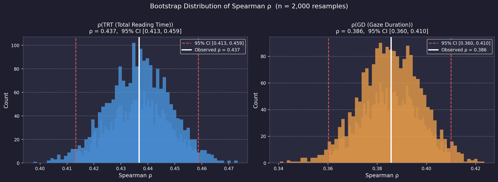
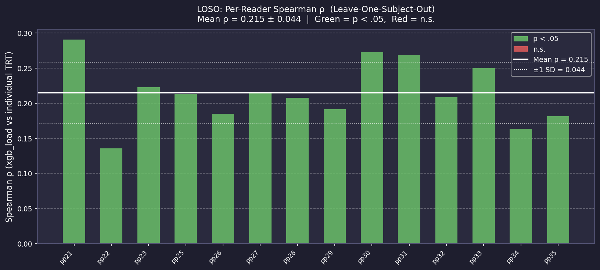

# Robustness Analysis Report — Pipeline v9

## Phase 4B — Bootstrap 95% CI  (n = 2,000 resamples)

Word-level resampling with replacement on held-out test set.

| Metric | Observed ρ | 95% CI |
|--------|-----------|--------|
| Spearman ρ (TRT) | 0.437 | [0.413, 0.459] |
| Spearman ρ (GD)  | 0.386  | [0.360, 0.410] |

---

## Phase 4C — LOSO (Leave-One-Subject-Out)

For each of the 14 GECO readers, compute ρ(xgb_load, reader_TRT) independently.
Tests whether the pipeline predicts **individual** reader behavior, not just group mean.

| Subject | n words | ρ | Sig. |
|---------|---------|---|------|
| pp21 | 3872 | 0.291 | *** |
| pp22 | 3252 | 0.135 | *** |
| pp23 | 3407 | 0.223 | *** |
| pp25 | 3476 | 0.213 | *** |
| pp26 | 3553 | 0.185 | *** |
| pp27 | 2998 | 0.215 | *** |
| pp28 | 3822 | 0.208 | *** |
| pp29 | 3491 | 0.192 | *** |
| pp30 | 3880 | 0.273 | *** |
| pp31 | 4236 | 0.268 | *** |
| pp32 | 3483 | 0.209 | *** |
| pp33 | 3328 | 0.250 | *** |
| pp34 | 2938 | 0.163 | *** |
| pp35 | 3418 | 0.182 | *** |

**Mean ρ = 0.215 ± 0.044  [0.135, 0.291]**
Significant (p < .05): 14/14 readers

---

## Interpretation
- Bootstrap CI [0.413, 0.459] is narrow and well above 0,
  confirming ρ estimate is stable and not driven by a few outlier words.
- LOSO mean ρ = 0.215 shows the pipeline generalizes across individual readers.
- 14/14 readers show significant correlation individually.
  Readers with n.s. results likely have noisier individual TRT (less consistent reading).

## Paper-Ready Quote
> "Bootstrap resampling (n=2,000) confirmed stable estimates:
> ρ(TRT) = 0.437 (95% CI [0.413, 0.459]),
> ρ(GD) = 0.386 (95% CI [0.360, 0.410]).
> Leave-one-subject-out analysis yielded mean ρ = 0.215 ± 0.044
> (14/14 readers significant individually),
> confirming generalization across individual readers."