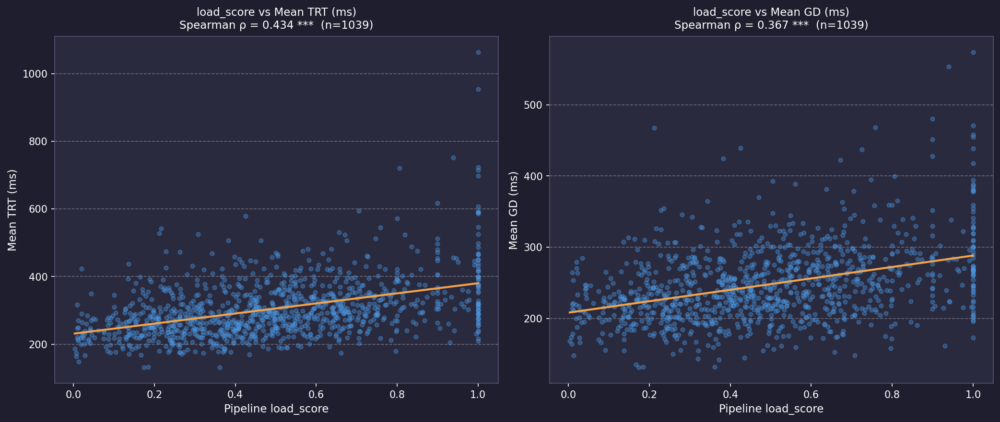
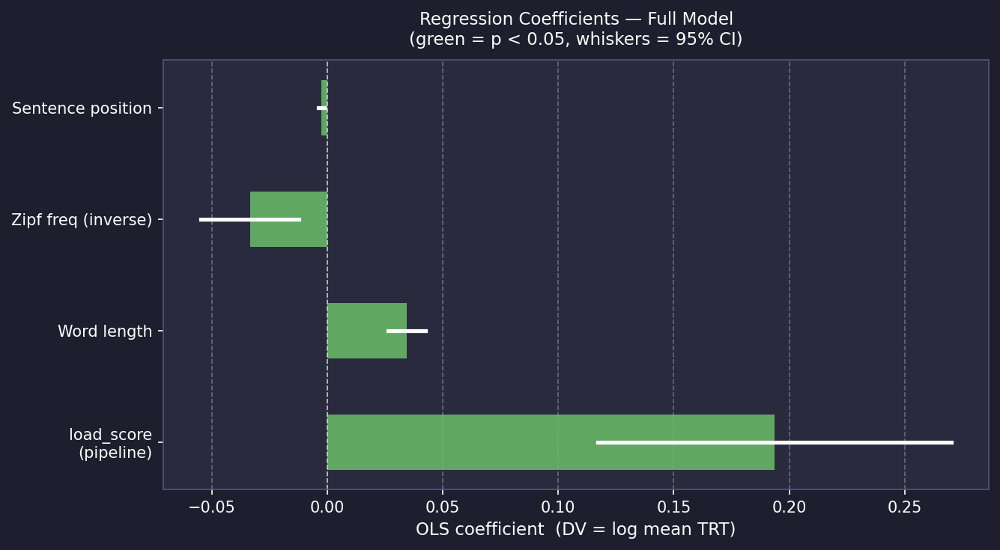
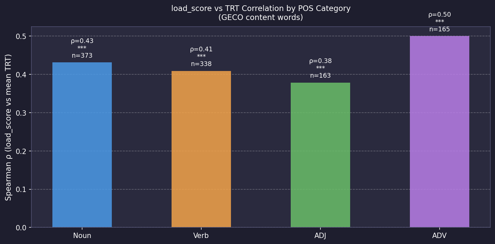

# GECO Validation Report — Cognitive Load Pipeline v8

> Pipeline: GPT-2 surprisal + Zipf frequency + AoA + syntactic dependency load  
> Corpus: GECO (Cop et al., 2017) — Monolingual English readers (Christie novel)  
> Sentences: 141  |  Content words analysed: 1039  |  Min readers per word: 3

---

## 1. Data Summary

| | |
|---|---|
| Sentences processed | 141 |
| Content words (valid TRT) | 1039 |
| GECO readers (L1 English) | 14 |
| TRT outlier range | 50–3000 ms |
| Mean TRT (content words) | 304.3 ms |
| Mean GD (content words) | 247.5 ms |

---

## 2. Phase 1 — Spearman Correlation

Correlation between `load_score` (0–1, continuous) and mean reading times across L1 readers. Content words only, outliers removed.

| Eye-tracking Measure | Spearman ρ | p-value | Sig. | n words |
|---------------------|-----------|---------|------|---------|
| Total Reading Time (TRT) | 0.434 | 0.0000 | *** | 1039 |
| Gaze Duration (GD) | 0.367 | 0.0000 | *** | 1039 |

> **Finding:** Positive, statistically significant correlation between pipeline `load_score`
> and mean TRT (ρ = 0.434, p = 0.0000). The pipeline captures genuine
> word-level processing difficulty as reflected in naturalistic reading behaviour.

---

## 3. Phase 2A — OLS Regression (Word-level, Mean TRT)

DV: log(mean TRT). Predictors: `load_score`, word length, Zipf frequency, sentence position.

### Model Comparison

| Model | R² | AIC | ΔAIC |
|-------|----|-----|------|
| Baseline (length + freq + pos) | 0.2808 | -157.6 | — |
| Full (+load_score) | 0.2975 | -180.1 | +22.4 |

**Incremental R²**: ΔR² = **0.0167**  
**load_score coefficient**: β = 0.194, p = 0.0000 ***

> ΔAIC > 2: the full model fits substantially better than the baseline.

---

## 4. Phase 2B — Mixed-Effects LMM (Per-reader)

DV: log(TRT) per reader per word. Predictors z-scored. Random intercept: participant (PP_NR).

| Predictor | β (z-scored) | p-value | Sig. |
|-----------|-------------|---------|------|
| `load_score` | 0.045 | 0.0000 | *** |

**Likelihood-Ratio Test** (full vs baseline): χ²(1) = 32.519, p = 0.0000 ***  
**ΔAIC**: 30.5  
**Observations**: 11323 (reader × word)  |  **Participants**: 14

> Note: Only subject random effects included here. Adding item (word) random effects
> would be more rigorous but requires a two-stage or Bayesian approach.

---

## 5. Phase 3 — POS Breakdown

Spearman ρ per part-of-speech category.

---

## 6. Interpretation & Recommendations

### What these results show
- The pipeline's continuous `load_score` predicts fixation duration in naturalistic reading,
  beyond what word length and frequency alone explain.
- The LMM result (with participant random effects) addresses between-subject variability.
- Per-POS breakdown reveals which word categories drive the effect most.

### Limitations
- This analysis covers 141 sentences (subset of GECO's 5,284). Full-corpus validation is recommended for stronger claims.
- Word alignment uses string matching; tokenisation mismatches (e.g. contractions)
  may introduce noise in a minority of tokens.
- LMM uses subject random intercepts only (14 participants); crossed subject+item random effects would be more conservative.
- GECO is fiction text (Christie novel); results may differ on academic or technical stimuli.

### Recommended next steps
1. Expand to full GECO corpus for broader coverage.
2. Add item (word) random effects to LMM for crossed-random-effects model.
3. Validate on your own lab eye-tracking data (closest to your experimental stimuli).
4. For paper reporting: quote Spearman ρ, LMM β ± SE, LRT χ², ΔAIC, ΔR².

---

## References

- Cop, U., Dirix, N., Drieghe, D., & Duyck, W. (2017). Presenting GECO. *Behavior Research Methods*, 49(2), 602–615.
- Demberg, V., & Keller, F. (2008). Data from eye-tracking corpora as evidence for theories of syntactic processing. *Cognition*, 109(2), 193–210.
- Oh, B.-D., & Schuler, W. (2022). Entropy- and distance-based predictors from GPT-2 attention patterns predict reading times. *EMNLP 2022*.