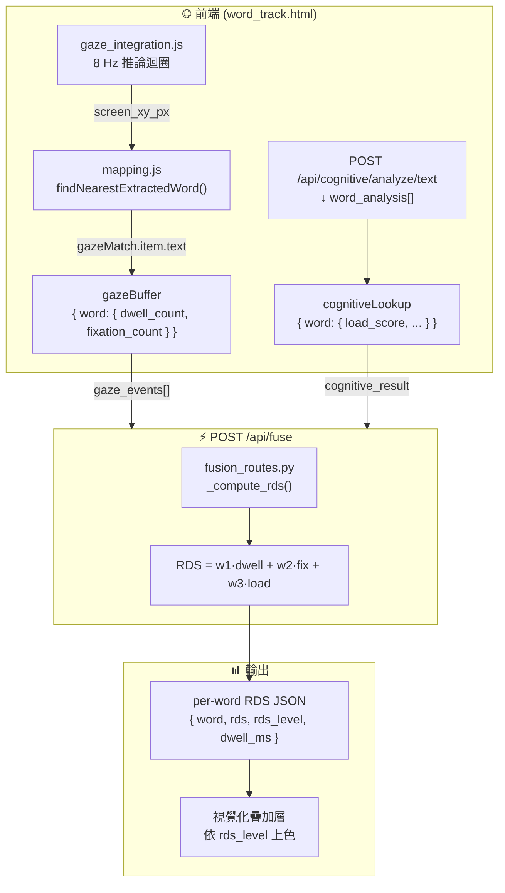

# LexiGaze 數據融合藍圖報告

> **CHI 文件 — 融合模組技術規格**  
> 本文件調查 `shengwen`（眼動）模組與 `weichi`（文字難度）模組的實際資料格式，  
> 並提出後端融合模組（`fusion_routes.py`）的完整實作規格。

---

## 目錄

1. [眼動感知端資料結構](#1-眼動感知端資料結構)
2. [語言認知端資料結構](#2-語言認知端資料結構)
3. [對齊痛點評估](#3-對齊痛點評估)
4. [Flask 整合建議位置](#4-flask-整合建議位置)

---

## 1. 眼動感知端資料結構

### 1.1 落地路徑規則

校準階段（Calibration）產生的感知資料存放於：

```
chenghao/gaze_data/sessions/<session_id>/manifest.jsonl
```

其中 `<session_id>` 的格式為：

```
YYYYMMDD_HHMMSS_<participant_id>_<8位hex>
範例：20260614_185500_alice_a1b2c3d4
```

每個 session 目錄的完整結構：

```
<session_id>/
  ├── session.json           ← session metadata
  ├── manifest.jsonl         ← 每個樣本一行 JSON（本文件的核心）
  ├── raw/                   ← 原始 JPEG 影格
  ├── crop/                  ← 正方形臉部裁切
  └── normalized_face/       ← 224×224 正規化臉部影像
```

> **重要區分：**
> - **校準資料**（`manifest.jsonl`）有完整欄位，落地存檔。
> - **即時推論**（`inference.py` → `/api/gaze/predict`）的輸出**不落地任何檔案**，直接以 HTTP JSON 回傳給前端，前端使用後即丟棄。

---

### 1.2 校準資料 `manifest.jsonl` 欄位清單

來源：`chenghao/gaze_core/sample_store.py` L144–L183

| 欄位名稱 | 型別 | 數值範圍 | 說明 |
|---|---|---|---|
| `ok` | bool | — | 是否成功處理此樣本 |
| `sample_index` | int | 0 ~ N-1 | session 內的樣本序號 |
| `phase` | str | `"calibration"` / `"validation"` | 採集階段 |
| `point_index` | int | 0 ~ 12 | 校準點在格子中的索引 |
| `repeat_index` | int | 0 ~ 7 | 同一校準點的重複次數 |
| `target_x` | float | 像素 | 校準目標點螢幕 X |
| `target_y` | float | 像素 | 校準目標點螢幕 Y |
| `target_x_norm` | float | [−1, 1] | 正規化 X |
| `target_y_norm` | float | [−1, 1] | 正規化 Y |
| `viewport_width` | float | 像素 | 瀏覽器可視區寬度 |
| `viewport_height` | float | 像素 | 瀏覽器可視區高度 |
| `screen_width` | float / null | 像素 | 裝置螢幕實體寬度（可能為 null） |
| `screen_height` | float / null | 像素 | 裝置螢幕實體高度（可能為 null） |
| `raw_path` | str | — | 相對路徑：`raw/<stem>.jpg` |
| `created_at_unix` | float | Unix 秒 | 採集的 Unix 時間戳（含小數） |
| `crop_path` | str | — | 相對路徑：`crop/<stem>.jpg` |
| `normalized_face_path` | str | — | 相對路徑：`normalized_face/<stem>.jpg` |
| `head_pose_pitch_yaw` | [float, float] | 弧度 | MediaPipe 頭部姿態 |
| `face_bbox` | dict | — | `{x, y, w, h, x_norm, y_norm, w_norm, h_norm}` |

**完整範例（一行 JSONL）：**

```json
{
  "ok": true,
  "sample_index": 5,
  "phase": "calibration",
  "point_index": 2,
  "repeat_index": 0,
  "target_x": 960.0,
  "target_y": 540.0,
  "target_x_norm": 0.0,
  "target_y_norm": 0.0,
  "viewport_width": 1920.0,
  "viewport_height": 1080.0,
  "screen_width": null,
  "screen_height": null,
  "raw_path": "raw/000005_calibration_02_00.jpg",
  "created_at_unix": 1749912000.123,
  "crop_path": "crop/000005_calibration_02_00.jpg",
  "normalized_face_path": "normalized_face/000005_calibration_02_00.jpg",
  "head_pose_pitch_yaw": [0.023, -0.041],
  "face_bbox": {
    "x": 220, "y": 80, "w": 180, "h": 200,
    "x_norm": 0.34, "y_norm": 0.17, "w_norm": 0.28, "h_norm": 0.42
  }
}
```

---

### 1.3 即時推論輸出（不落地，HTTP 回應）

來源：`chenghao/gaze_core/inference.py` L137–L146

```json
{
  "ok": true,
  "screen_xy_norm": [-0.12, 0.34],
  "screen_xy_px": [556.8, 410.4],
  "gaze_pitch_yaw": [0.08, -0.03],
  "head_pose_pitch_yaw": [0.02, -0.07],
  "face_bbox": {"x": 220, "y": 80, "w": 180, "h": 200},
  "model_name": "user_model_v2",
  "source": "unigaze"
}
```

**缺失欄位（融合時需補充）：**

| 缺少的欄位 | 說明 | 解決方案 |
|---|---|---|
| `timestamp_ms` | 無時間戳 | 前端在每次推論回傳後由 `Date.now()` 補充 |
| `word` | 無對齊單字 | 前端 `mapping.js` 完成對齊後，由前端在 gaze_event buffer 中補充 |
| `dwell_ms` | 無停留時間 | 前端累計每個 word 的 gaze_count × 120ms |

---

## 2. 語言認知端資料結構

### 2.1 落地路徑

**即時分析結果**由 `CognitiveLoadPipeline.run()` 計算後，透過 `cognitive_routes.py` HTTP 回傳，**不主動寫入常駐 JSON 檔案**。

唯一的**離線預訓練模型檔**：

```
weichi/ridge_model.json
```

封存的分析結果（選擇性落地）：

```
archive/analysis_results/<timestamp>_<filename>.json
```

---

### 2.2 `ridge_model.json` 完整結構

來源：`weichi/ridge_model.json`

```json
{
  "features": ["surprisal", "entropy", "aoa_score", "word_length", "zipf_score", "pos_score"],
  "coef": [11.84, 5.34, 10.36, 14.99, -20.57, -5.34],
  "intercept": 301.37,
  "scaler_mean": [9.69, 8.65, 0.43, 5.50, 5.10, 0.87],
  "scaler_std": [4.57, 3.69, 0.21, 2.19, 1.06, 0.21],
  "alpha": 100.0,
  "r2_train": 0.2976,
  "r2_val": 0.3351,
  "n_samples": 663
}
```

> 此 ridge model 以 GECO 語料庫訓練，預測**閱讀時間（Total Reading Time，毫秒）**。  
> 輸出為原始迴歸值（非 0~1），由 pipeline 在後續步驟 min-max 正規化後寫入 `load_score`。

---

### 2.3 `WordResult` 欄位清單（認知端每字粒度輸出）

來源：`weichi/cognitive_load_pipeline.py` L46–L61（`@dataclass WordResult`）

| 欄位名稱 | 型別 | 數值區間 | 說明 |
|---|---|---|---|
| `word` | str | — | 原始單字字串（英文可能為連字號複合詞） |
| `pos` | str | — | 詞性標籤（spaCy：`NOUN`/`VERB`；jieba：`n`/`v`） |
| `position` | int | 0 ~ N-1 | 在本次文本中的序號 |
| `surprisal` | float | 0 ~ ~15 | BERT/GPT-2 資訊量（越高 = 越出乎預料，**未正規化**） |
| `entropy` | float | 0 ~ 1 | 模型在此位置的預測不確定度（正規化） |
| `dependency_load` | float | 0 ~ 1 | 語法依賴整合成本（英文 spaCy / 中文距離估算） |
| `zipf_score` | float | 0 ~ 8 | wordfreq Zipf 詞頻（越低 = 越罕見） |
| `word_length` | int | ≥ 1 | 字元數（英文）或子詞數（中文） |
| `pos_score` | float | 0.0 ~ 1.0 | 詞性重要性乘數（`NOUN`/`VERB` = 1.0，標點符號 = 0.0） |
| `load_level` | str | `"high"` / `"medium"` / `"low"` | 最終三級分類標籤 |
| **`load_score`** | **float** | **0.0 ~ 1.0** | **核心融合欄位：正規化認知負荷分數** |
| `aoa_score` | float | 0.0 ~ 1.0 | Kuperman 詞彙習得年齡分數（**中文固定為 0.0**） |
| `renyi_entropy` | float | 0.0 ~ 1.0 | Rényi entropy（α=0.5，Pimentel et al. 2023） |

---

### 2.4 `pipeline.run()` 回傳值頂層結構

來源：`weichi/cognitive_load_pipeline.py` L608–L618

```json
{
  "model": "gpt2",
  "lang": "en",
  "domain": "general",
  "process_time_ms": 847,
  "high_load_words": ["neuro-symbolic", "calibration"],
  "word_analysis": [
    {
      "word": "neuro-symbolic",
      "pos": "NOUN",
      "position": 3,
      "surprisal": 14.2,
      "entropy": 0.83,
      "dependency_load": 0.45,
      "zipf_score": 1.1,
      "word_length": 14,
      "pos_score": 1.0,
      "load_level": "high",
      "load_score": 0.92,
      "aoa_score": 0.71,
      "renyi_entropy": 0.61
    }
  ]
}
```

> **融合模組應使用 `load_score`（已正規化至 [0,1]）而非 `surprisal`（未正規化）作為語言難度訊號。**

---

## 3. 對齊痛點評估

### 痛點 1 🔴 — 即時眼動完全缺少時間欄位

**問題描述：**  
`inference.py` 的 HTTP 回應沒有 `timestamp`、`dwell_ms` 或 `duration` 欄位。前端以固定 **120 ms** 輪詢頻率呼叫 `/api/gaze/predict`（`gaze_integration.js`），但此時間資訊完全未被記錄或傳遞。

**影響：**  
融合模組 RDS 公式中的「停留時間 d̂(w)」無法從任何現有落地資料計算。

**建議修復方案：**  
在前端 `gaze_integration.js` 的推論回呼中補充 `Date.now()`，並以 `word` 為 key 累計：

```javascript
// gaze_integration.js 中的修改建議
const gazeBuffer = {};  // { word: { dwell_count, fixation_count, first_seen_ms } }

function onGazeResult(result, gazeMatch) {
  if (!gazeMatch) return;
  const word = gazeMatch.item.text.toLowerCase();
  const now = Date.now();
  if (!gazeBuffer[word]) {
    gazeBuffer[word] = { dwell_count: 0, fixation_count: 1, first_seen_ms: now };
  }
  gazeBuffer[word].dwell_count += 1;  // × 120ms = dwell_ms
}
```

---

### 痛點 2 🔴 — 眼動端無 `word`，認知端無座標，對齊只在記憶體

**問題描述：**  
眼動資料只有像素座標 `screen_xy_px`；認知資料只有 `word` 字串。兩者的對齊目前發生在前端 `mapping.js` 的 `findNearestExtractedWord()` 函式，且結果**不落地**，是完全短暫的 in-memory 狀態。

**影響：**  
後端 `fusion_routes.py` 無法重建「哪個 gaze 點命中了哪個 word」的對應關係，必須由前端傳入已對齊的 `word` 欄位。

**建議修復方案：**  
在前端 `processGazeOnExtractedData()` 得到 `gazeMatch` 後，同時將對齊結果放入 buffer，session 結束時批次 POST 至 `/api/fuse`：

```javascript
// mapping.js 中的修改建議
function processGazeOnExtractedData(gazeX, gazeY) {
  if (!gazeMappingOn) return;
  gazeMatch = findNearestExtractedWord(gazeX, gazeY);
  if (gazeMatch) {
    recordGazeEvent(gazeMatch.item.text, gazeMatch.confidence);
  }
  drawHighlights();
}
```

---

### 痛點 3 🟡 — 單字大小寫正規化不一致

**問題描述：**  
`CognitiveLoadPipeline` 輸出的 `WordResult.word` 保留原始大小寫（如 `"The"`、`"NLP"`）。PDF.js 提取的 `item.text` 亦可能含大寫。但 wordfreq 查詢時使用小寫，導致兩端 key 不一致。

**風險 Bug：**  
如果 PDF 標題有 `"INTRODUCTION"` 但認知分析輸出為 `"introduction"`，字典查詢會 miss，導致該詞的 `load_score` 被誤設為預設的 `0.0`。

**建議修復方案：**

```javascript
// word_track.html 中建立 cognitiveLookup 時統一 toLowerCase()
cognitiveLookup = {};
word_analysis.forEach(item => {
  cognitiveLookup[item.word.toLowerCase()] = item;
});

// 查詢時同樣 toLowerCase()
const entry = cognitiveLookup[gazeMatch.item.text.toLowerCase()];
```

---

### 痛點 4 🟡 — 連字號複合詞 `word` 對齊錯誤

**問題描述：**  
`CognitiveLoadPipeline._reaggregate_hyphenated()` 將 `["neuro", "-", "symbolic"]` 合併為 `"neuro-symbolic"` 後，認知端的 key 是完整複合詞。但 PDF.js 可能將同一詞拆成三個獨立的 `item.text`，導致眼動端命中的是子詞，在 `cognitiveLookup` 中查不到完整複合詞的分數。

**建議修復方案：**  
在前端查詢邏輯中加入「子詞前綴模糊比對」：

```javascript
function lookupCognitive(text) {
  const key = text.toLowerCase();
  if (cognitiveLookup[key]) return cognitiveLookup[key];
  // 子詞前綴比對：找包含此 key 的複合詞
  for (const [k, v] of Object.entries(cognitiveLookup)) {
    if (k.includes(key) && k.includes('-')) return v;
  }
  return null;
}
```

---

### 注意 5 ℹ️ — 中文模式無 `aoa_score`

`aoa_score` 在中文模式下固定為 `0.0`（無 Kuperman 詞表）。  
融合公式在中文模式下應跳過 `aoa_score` 維度，或將其權重重新分配給其他特徵。

---

## 4. Flask 整合建議位置

### 4.1 目標檔案與行數

**檔案：** `chenghao/server.py`

```python
# 現有第 28–30 行（不變）
app.register_blueprint(gaze_bp)
app.register_blueprint(gaze_api_bp)
app.register_blueprint(cognitive_bp)

# ↓ 在第 30 行後新增（第 31–32 行）
from fusion_routes import fusion_bp   # ← 新增
app.register_blueprint(fusion_bp)     # ← 新增
```

**選擇此位置的理由：**
- 遵循現有「每個功能域一個 Blueprint，統一在 server.py 頂部 import 並 register」的架構規範。
- `cognitive_bp` 先於 `fusion_bp` 註冊，語意上正確（先有認知分數，才能融合）。
- 只修改 2 行，不影響任何現有路由行為，風險最低。

---

### 4.2 新建檔案規格：`chenghao/fusion_routes.py`

```python
"""
fusion_routes.py — LexiGaze Fusion Blueprint
POST /api/fuse  ← 接收前端送來的已對齊 gaze-word 事件批次，
                   計算每個單字的 RDS（Reading Difficulty Score）並回傳。
"""
from __future__ import annotations
from flask import Blueprint, jsonify, request

fusion_bp = Blueprint("fusion", __name__, url_prefix="/api/fuse")


@fusion_bp.post("/")
def fuse():
    """
    預期 request body:
    {
      "session_id": "...",
      "cognitive_result": {
        "word_analysis": [
          { "word": "neuro-symbolic", "load_score": 0.92, ... }
        ]
      },
      "gaze_events": [
        {
          "word": "neuro-symbolic",
          "dwell_count": 5,        // x 120ms = dwell_ms
          "fixation_count": 2,
          "confidence": "high",
          "timestamp_ms": 1749912000123
        }
      ]
    }
    """
    body = request.get_json(force=True) or {}
    cognitive_result = body.get("cognitive_result", {})
    gaze_events = body.get("gaze_events", [])

    # 建立 word -> load_score lookup（小寫正規化）
    load_lookup = {
        item["word"].lower(): item.get("load_score", 0.0)
        for item in cognitive_result.get("word_analysis", [])
    }

    rds_results = _compute_rds(gaze_events, load_lookup)
    return jsonify({"ok": True, "rds": rds_results})


def _compute_rds(
    gaze_events: list[dict],
    load_lookup: dict[str, float],
    w1: float = 0.35,   # dwell 權重
    w2: float = 0.25,   # fixation 權重
    w3: float = 0.40,   # load_score 權重
) -> list[dict]:
    """
    RDS(w) = w1 * dwell_norm(w) + w2 * fixation_norm(w) + w3 * load_score(w)
    """
    if not gaze_events:
        return []

    aggregated: dict[str, dict] = {}
    for event in gaze_events:
        key = event.get("word", "").lower()
        if not key:
            continue
        if key not in aggregated:
            aggregated[key] = {"word": event.get("word", key), "dwell_ms": 0, "fixation_count": 0}
        aggregated[key]["dwell_ms"] += event.get("dwell_count", 0) * 120
        aggregated[key]["fixation_count"] += event.get("fixation_count", 0)

    if not aggregated:
        return []

    max_dwell = max(v["dwell_ms"] for v in aggregated.values()) or 1
    max_fix   = max(v["fixation_count"] for v in aggregated.values()) or 1

    results = []
    for key, agg in aggregated.items():
        dwell_norm = agg["dwell_ms"] / max_dwell
        fix_norm   = agg["fixation_count"] / max_fix
        load_score = load_lookup.get(key, 0.0)
        rds = round(w1 * dwell_norm + w2 * fix_norm + w3 * load_score, 4)

        if rds >= 0.70:
            rds_level = "difficulty"
        elif rds >= 0.40:
            rds_level = "attention"
        else:
            rds_level = "fluent"

        results.append({
            "word": agg["word"],
            "load_score": load_score,
            "dwell_ms": agg["dwell_ms"],
            "fixation_count": agg["fixation_count"],
            "rds": rds,
            "rds_level": rds_level,
        })

    results.sort(key=lambda x: x["rds"], reverse=True)
    return results
```

---

### 4.3 完整資料流圖（融合後）



---

*文件版本：1.0 — 初稿由程式碼自動調查生成*  
*調查日期：2026-06-14*  
*對應系統架構文件：`docs/CHI/system_architecture.md` §7*
