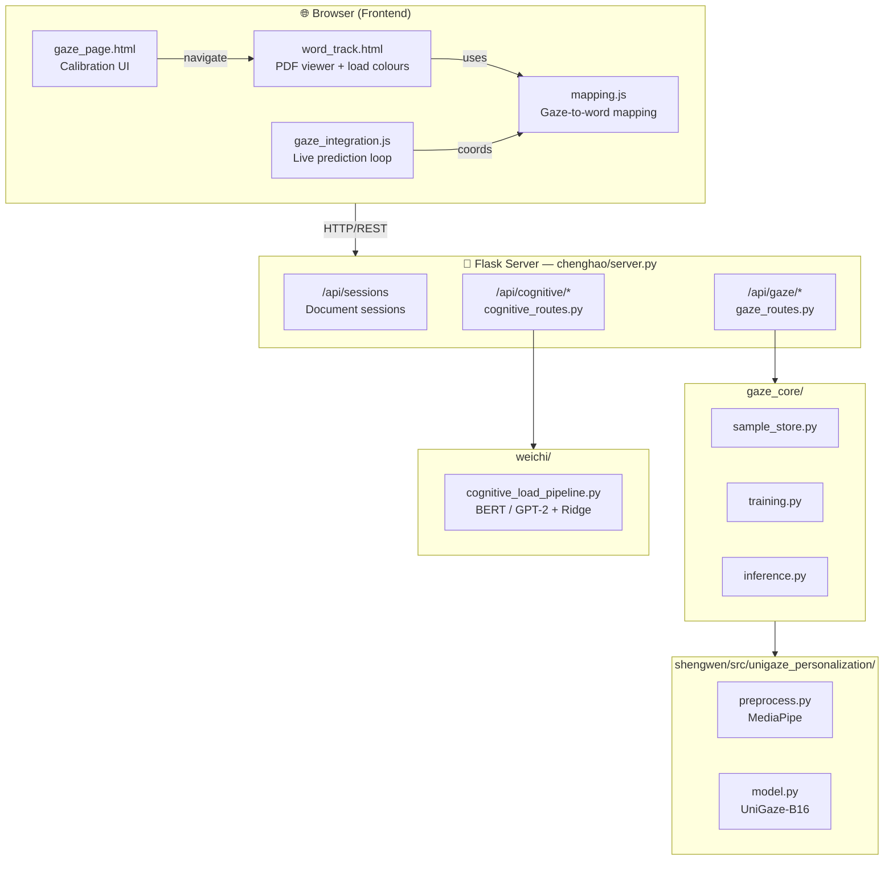
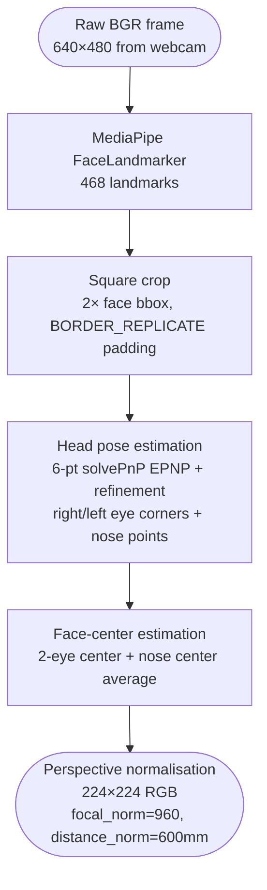
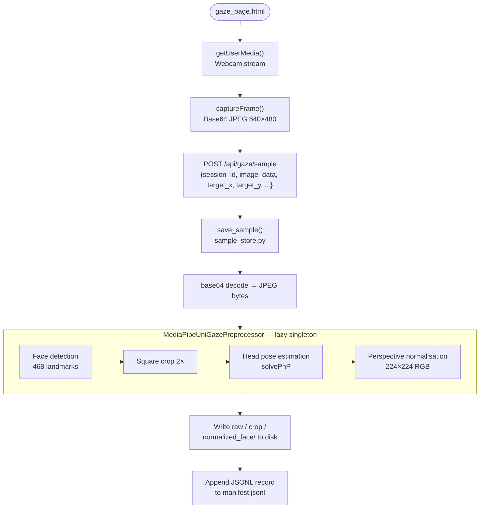
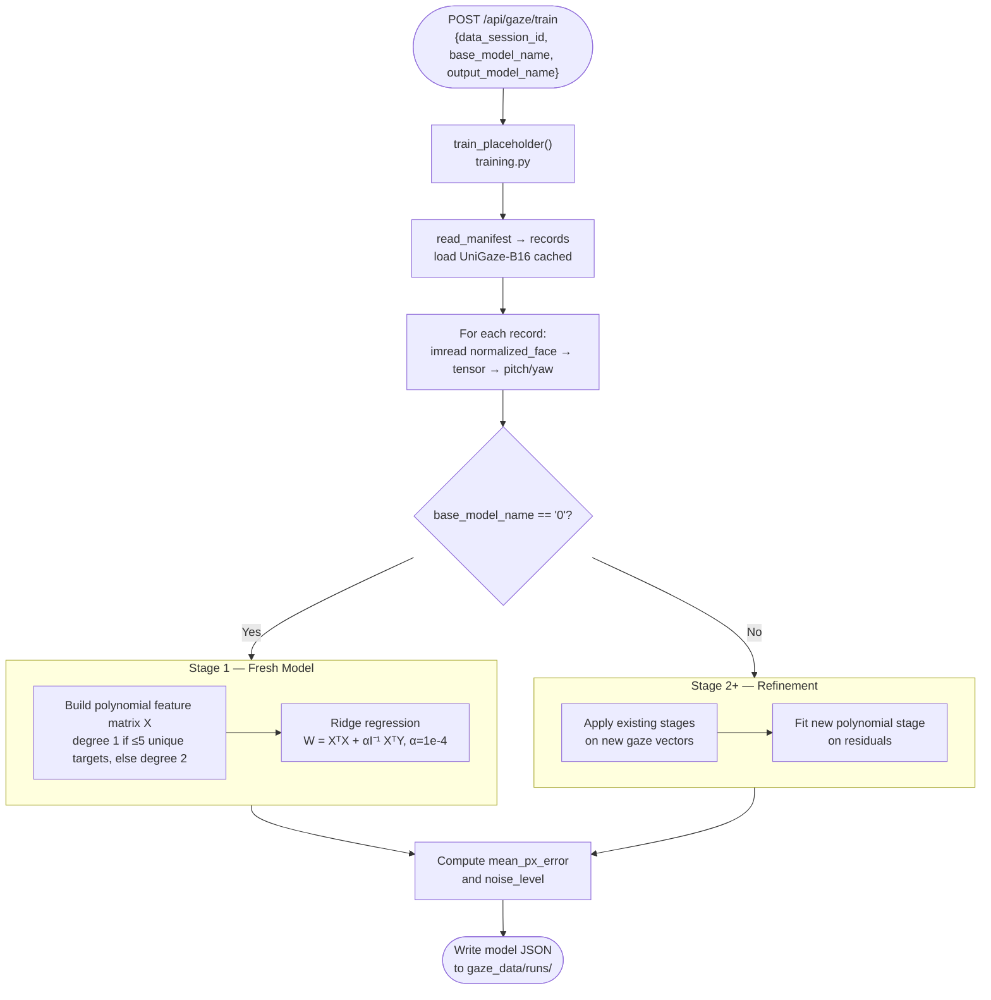
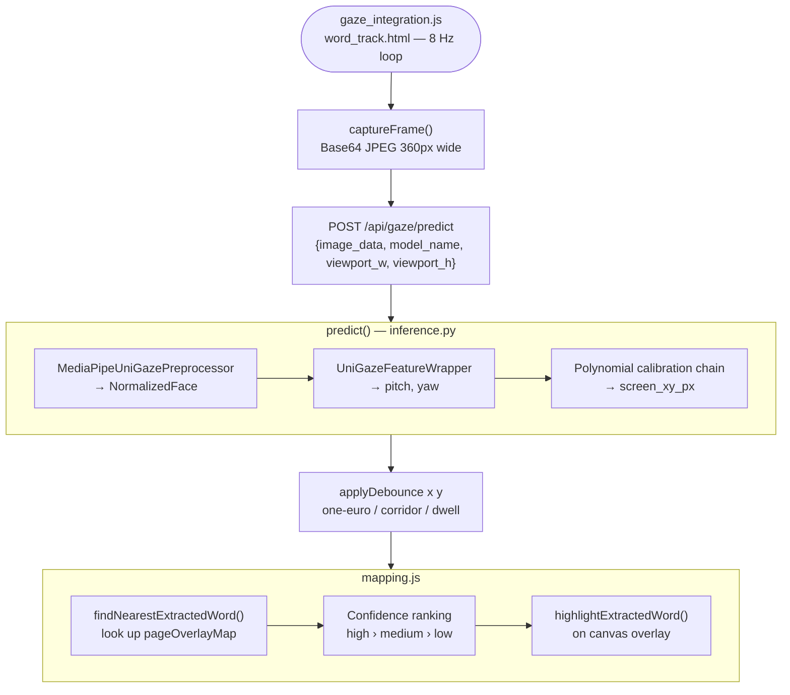
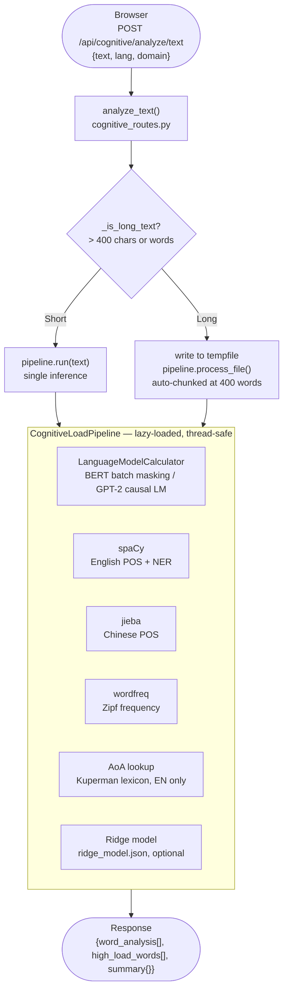
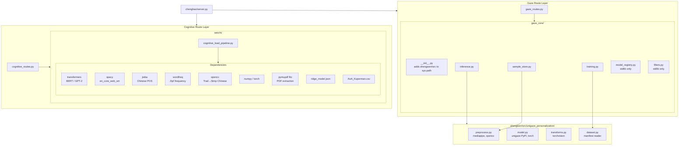

# LexiGaze: Integrated System Architecture

> **CHI Documentation — Technical Reference**
> This document describes the full system architecture of LexiGaze as integrated in the `chenghao/` module, covering the Flask backend, gaze-tracking pipeline, cognitive load analysis, and frontend UI.

---

## Table of Contents

1. [System Overview](#1-system-overview)
2. [Module Ownership](#2-module-ownership)
3. [Repository Layout](#3-repository-layout)
4. [Backend: Flask Server](#4-backend-flask-server)
5. [Gaze Tracking Pipeline](#5-gaze-tracking-pipeline)
6. [Cognitive Load Pipeline](#6-cognitive-load-pipeline)
7. [Integration Layer](#7-integration-layer)
8. [Frontend UI](#8-frontend-ui)
9. [REST API Reference](#9-rest-api-reference)
10. [Data Flow Diagrams](#10-data-flow-diagrams)
11. [File-System Layout of Runtime Data](#11-file-system-layout-of-runtime-data)
12. [Dependency Graph](#12-dependency-graph)
13. [Configuration & Environment](#13-configuration--environment)

---

## 1. System Overview

LexiGaze is a **Neuro-Symbolic AI** reading-research platform that fuses two sources of signal:

| Signal type | Technology | Module owner |
|---|---|---|
| **Neural perception** — where the user is looking | UniGaze-B16 (ViT-based) + polynomial calibration | `shengwen` (model) / `chenghao` (integration) |
| **Symbolic cognition** — how hard each word is to read | BERT / GPT-2 surprisal + Ridge Regression | `weichi` (pipeline) / `chenghao` (integration) |

These two signals are **fused in the frontend**: the gaze cursor position is mapped to extracted word coordinates, and each word carries a pre-computed cognitive-load score. This enables per-word reading difficulty analysis anchored to where the reader actually looks.



---

## 2. Module Ownership

| Directory | Owner | Role |
|---|---|---|
| `chenghao/` | Chenghao | Integration hub: Flask server, gaze API routes, cognitive API routes, frontend pages |
| `shengwen/` | Shengwen | UniGaze-B16 face preprocessing, gaze model wrapper |
| `weichi/` | Weichi | Cognitive load pipeline (BERT/GPT-2 surprisal + Ridge Regression) |
| `BoWei/` | BoWei | Supplementary mapping visualisation (`mapping.html`, `mapping.js`) |

---

## 3. Repository Layout

```
lexigaze/
├── chenghao/                   ← Main integration hub
│   ├── server.py               ← Flask application entry-point
│   ├── gaze_routes.py          ← Gaze API blueprints (/api/gaze/* + /api/*)
│   ├── cognitive_routes.py     ← Cognitive load API blueprint (/api/cognitive/*)
│   ├── gaze_page.html          ← Calibration / data-collection UI
│   ├── gaze_page.js            ← Calibration UI logic
│   ├── gaze_integration.js     ← Live gaze inference loop for word_track page
│   ├── mapping.js              ← Gaze-to-word coordinate mapping
│   ├── word_track.html         ← Main document reading interface (88 KB)
│   └── gaze_core/              ← Backend gaze logic package
│       ├── __init__.py         ← sys.path bootstrap (adds shengwen/src)
│       ├── filters.py          ← OneEuroFilter placeholder
│       ├── inference.py        ← Gaze prediction pipeline
│       ├── model_registry.py   ← Model JSON management
│       ├── sample_store.py     ← Calibration sample storage + preprocessing
│       └── training.py         ← Polynomial calibration training
├── shengwen/
│   ├── face_landmarker.task    ← MediaPipe face landmarker model (3.6 MB)
│   └── src/
│       └── unigaze_personalization/
│           ├── preprocess.py   ← MediaPipeUniGazePreprocessor
│           ├── model.py        ← UniGazeFeatureWrapper + load_unigaze_b16
│           ├── dataset.py      ← read_manifest helper
│           └── transforms.py   ← to_unigaze_tensor
├── weichi/
│   ├── cognitive_load_pipeline.py  ← Full cognitive load inference pipeline
│   ├── ridge_model.json            ← Pre-trained ridge regression weights
│   └── GECO_data/
│       └── AoA_Kuperman.csv        ← Kuperman Age-of-Acquisition lexicon
├── data/                       ← Document session storage (JSON files)
├── archive/analysis_results/   ← Archived cognitive load analysis results
└── hub/                        ← Hugging Face model cache
```

---

## 4. Backend: Flask Server

**File:** `chenghao/server.py`

The Flask application is the single entry-point for all HTTP traffic. It registers three blueprints and also serves static files.

### Blueprint Registration

```python
app.register_blueprint(gaze_bp)        # /api/gaze/*
app.register_blueprint(gaze_api_bp)    # /api/*  (legacy flat namespace)
app.register_blueprint(cognitive_bp)   # /api/cognitive/*
```

### Static Routes

| Route | Serves |
|---|---|
| `GET /` | `word_track.html` — the main document viewer |
| `GET /gaze` | `gaze_page.html` — the calibration interface |
| `GET /gaze_static/<filename>` | Files from `shengwen/web/static/` (CSS, app.js) |
| `GET /<filename>` | Any file from `chenghao/` root |

### Document Session API

These routes manage **document reading sessions** — snapshots of word coordinates extracted from an uploaded PDF/document.

| Method | Route | Purpose |
|---|---|---|
| `GET` | `/api/ping` | Health check; returns number of stored sessions |
| `GET` | `/api/sessions` | List all sessions (metadata only) |
| `POST` | `/api/sessions` | Save a new session |
| `GET` | `/api/sessions/<id>` | Retrieve full session data |
| `DELETE` | `/api/sessions/<id>` | Delete a session file |

**Session JSON schema** (stored in `chenghao/data/<uuid>.json`):

```json
{
  "id": "uuid-v4",
  "filename": "paper.pdf",
  "filetype": "pdf",
  "created_at": "2026-06-11T03:09:46",
  "item_count": 412,
  "items": [
    {
      "text": "neuro-symbolic",
      "left": 120, "top": 88,
      "right": 245, "bottom": 108,
      "width": 125, "height": 20
    }
  ]
}
```

### Configuration

| Setting | Value | Purpose |
|---|---|---|
| `MAX_CONTENT_LENGTH` | 50 MB | Allows PDF file uploads to the cognitive analysis endpoint |
| `host` | `localhost` | Binds only on loopback |
| `port` | `8080` | Default serving port |

---

## 5. Gaze Tracking Pipeline

### 5.1 UniGaze Preprocessing (`shengwen`)

**File:** `shengwen/src/unigaze_personalization/preprocess.py`

The `MediaPipeUniGazePreprocessor` class turns a raw BGR webcam frame into a standardised `NormalizedFace` dataclass that can be fed to UniGaze-B16.

**Processing pipeline:**



**Output `NormalizedFace` fields:**

| Field | Type | Description |
|---|---|---|
| `image_rgb` | `np.ndarray` (224×224×3) | Normalised face image for model input |
| `image_bgr` | `np.ndarray` (224×224×3) | Same image in BGR for OpenCV save |
| `crop_bgr` | `np.ndarray` | Raw square face crop |
| `landmarks` | `np.ndarray` (468×2) | All MediaPipe landmarks in original frame coords |
| `face_bbox` | `dict` | `{x, y, w, h, x_norm, y_norm, w_norm, h_norm}` |
| `head_pose_pitch_yaw` | `np.ndarray` (2,) | Head pose in normalised camera space (radians) |
| `warp_matrix` | `np.ndarray` (3×3) | Perspective warp matrix used for normalisation |

**Model loading:** `shengwen/src/unigaze_personalization/model.py`

```python
@functools.lru_cache(maxsize=2)
def load_unigaze_b16(device: str = "cpu") -> nn.Module:
    model = unigaze.load("unigaze_b16_joint", device=device)
    model.eval()
    return model
```

`UniGazeFeatureWrapper` exposes the ViT backbone (`model.vit.forward_features`) and the gaze fully-connected head (`model.gaze_fc`) returning `[pitch, yaw]` in radians.

---

### 5.2 Sample Store

**File:** `chenghao/gaze_core/sample_store.py`

Manages on-disk storage of calibration samples collected from the browser.

#### `create_session(root, participant_id) → dict`

Creates a new calibration session directory under `chenghao/gaze_data/sessions/<session_id>/` with three subdirectories:

```
<session_id>/
  ├── session.json         ← metadata
  ├── manifest.jsonl       ← per-sample records (appended)
  ├── raw/                 ← original JPEG frames
  ├── crop/                ← square face crops
  └── normalized_face/     ← 224×224 normalised images
```

Session ID format: `YYYYMMDD_HHMMSS_<participant_id>_<8hex>`

#### `save_sample(root, payload) → (dict, int)`

Receives a JSON payload from the browser containing:

| Field | Type | Description |
|---|---|---|
| `session_id` | str | Target session |
| `image_data` | str | Base64-encoded JPEG (data-URI or raw) |
| `target_x`, `target_y` | float | Screen-pixel coords of calibration target |
| `viewport_width`, `viewport_height` | float | Browser viewport dimensions |
| `phase` | str | `"calibration"` or `"validation"` |
| `point_index` | int | Index in calibration point grid |
| `repeat_index` | int | Repeat number for this point |

**Processing steps:**
1. Decode base64 → JPEG bytes → OpenCV BGR image
2. Run `MediaPipeUniGazePreprocessor.process()` (thread-safe, lazy singleton)
3. Save raw, crop, and normalised images to disk
4. Compute normalised target coordinates: `target_x_norm = (target_x / viewport_width) * 2 − 1`
5. Append a JSONL record to `manifest.jsonl`

Thread safety is ensured via `_manifest_lock` and `_preprocessor_lock`.

---

### 5.3 Calibration Training

**File:** `chenghao/gaze_core/training.py`

Implements **multi-stage polynomial ridge regression** to map UniGaze raw gaze angles to user-specific screen coordinates.

#### `train_placeholder(root, payload) → (dict, int)`

**Input payload:**

| Field | Description |
|---|---|
| `data_session_id` | Session directory containing calibration samples |
| `base_model_name` | `"0"` for fresh Stage 1, or an existing model name for Stage 2+ |
| `output_model_name` | Name for the resulting model JSON |

**Training algorithm:**

**Stage 1 (fresh model):**
1. Load all valid records from `manifest.jsonl` via `read_manifest()`
2. Run UniGaze-B16 on each normalised face image → `[pitch, yaw]`
3. Build feature matrix **X**:
   - ≤ 5 unique targets → degree 1: `[yaw, pitch, 1]`
   - ≥ 6 samples + > 5 targets → degree 2: `[yaw, pitch, yaw², pitch², yaw·pitch, 1]`
4. Solve ridge regression: `W = (XᵀX + αI)⁻¹ Xᵀ Y`, with `α = 1e-4`

**Stage 2+ (refining existing model):**
1. Run all existing stages sequentially on the new calibration gaze vectors to obtain residual coordinates
2. Fit a new polynomial stage on top of the residuals

**Error & noise metrics saved:**
- `mean_px_error`: RMSE in screen pixels across all training samples
- `noise_level`: Mean standard deviation of predictions per calibration point (repeatability)

**Output model JSON** (saved to `chenghao/gaze_data/runs/<name>.json`):

```json
{
  "name": "user_model_v2",
  "created_at": "2026-06-11T03:09:46",
  "data_session_id": "20260611_030946_alice_a1b2c3d4",
  "stages": [
    { "stage": 1, "W": [[...]], "poly_degree": 2, "mean_px_error": 0.0 },
    { "stage": 2, "W": [[...]], "poly_degree": 1, "mean_px_error": 38.2 }
  ],
  "mean_px_error": 38.2,
  "noise_level": 12.5,
  "train_samples": 26
}
```

---

### 5.4 Inference

**File:** `chenghao/gaze_core/inference.py`

#### `predict(root, payload) → (dict, int)`

**Input payload:**

| Field | Description |
|---|---|
| `image_data` | Base64-encoded JPEG webcam frame |
| `model_name` | `"before"` for frozen baseline, or a trained model name |
| `viewport_width`, `viewport_height` | Browser viewport dimensions |

**Processing steps:**
1. Decode image → OpenCV BGR
2. Run `MediaPipeUniGazePreprocessor` → `NormalizedFace`
3. Run `UniGazeFeatureWrapper` → `[pitch, yaw]` (radians)
4. Map to screen coordinates:
   - **Baseline (`"before"`):** `pred_x = clamp(yaw × 4.5, −1, 1)`, `pred_y = clamp(pitch × 4.5, −1, 1)`
   - **Calibrated model:** Apply each stage's polynomial chain sequentially
5. Convert normalised `[−1, 1]` to pixel coordinates: `pixel_x = ((pred_x + 1) × 0.5) × viewport_width`

**Response:**

```json
{
  "ok": true,
  "screen_xy_norm": [-0.12, 0.34],
  "screen_xy_px": [556.8, 410.4],
  "gaze_pitch_yaw": [0.08, -0.03],
  "head_pose_pitch_yaw": [0.02, -0.07],
  "face_bbox": { "x": 220, "y": 80, "w": 180, "h": 200 },
  "model_name": "user_model_v2",
  "source": "unigaze"
}
```

Both `_preprocessor` and the base model are cached as thread-safe singletons using `threading.Lock()` + double-checked locking.

---

### 5.5 Model Registry

**File:** `chenghao/gaze_core/model_registry.py`

| Function | Description |
|---|---|
| `ensure_runs_dir(root)` | Creates `chenghao/gaze_data/runs/` if absent; returns `Path` |
| `list_models(root)` | Scans `*.json` in runs dir; returns list of model metadata dicts |
| `clean_model_name(name)` | Sanitises model name to `[a-zA-Z0-9\-_]` |
| `model_path(root, name)` | Returns `Path` to `<runs_dir>/<name>.json` |

**Model metadata dict:**

```python
{
  "name": "user_v2",
  "display_name": "user_v2 (26 samples, 38.2 px)",
  "mean_px_error": 38.2,
  "num_stages": 2,
  "noise_level": 12.5,
  "train_samples": 26,
  "created_at": "2026-06-11T03:09:46"
}
```

---

## 6. Cognitive Load Pipeline

**File:** `weichi/cognitive_load_pipeline.py`

This is the **Symbolic Cognition** component. It quantifies per-word reading difficulty using a multi-feature scoring approach.

### 6.1 Language Model Calculator

`LanguageModelCalculator` wraps HuggingFace Transformers to compute three signals per word:

| Signal | Description | Method |
|---|---|---|
| **Surprisal** | Negative log-probability of the word given context | BERT masked LM / GPT-2 causal LM |
| **Entropy** | Prediction uncertainty at each token position | Shannon entropy over vocabulary distribution |
| **Attention** | Average attention centrality across last 4 BERT layers | (BERT only) |

**Supported models:**

| `model_type` | Chinese | English |
|---|---|---|
| `bert` | `bert-base-chinese` | `bert-base-uncased` |
| `gpt2` | `uer/gpt2-chinese-cluecorpussmall` | `gpt2` |
| `gpt2-medium` | *(same as gpt2)* | `gpt2-medium` |

**BERT batch masking optimisation:**
Instead of one forward pass per word, all masked sequences are batched and processed in chunks of `batch_size=32`, achieving **3–5× speed-up** over naive word-by-word inference.

**GPT-2 chunking:**
GPT-2 position embeddings are limited to 1024 tokens. For long texts, binary search finds the maximum words per chunk and surprisals are accumulated across chunks.

---

### 6.2 CognitiveLoadPipeline Class

`CognitiveLoadPipeline(model_type, lang)` orchestrates the full per-word scoring.

**Features computed per word:**

| Feature | Description | Weight in scoring |
|---|---|---|
| `surprisal` | Contextual unpredictability (BERT/GPT-2) | Primary driver |
| `entropy` | Model prediction uncertainty | Modulates surprisal |
| `zipf_score` | Word-frequency rank (wordfreq library) | Rare words → higher load |
| `word_length` | Character/token count | Longer → harder |
| `pos_score` | Part-of-speech weight (nouns/verbs=1.0, punctuation=0.0) | Suppresses function words |
| `aoa_score` | Kuperman Age-of-Acquisition (English only) | Later-acquired → harder |
| `dependency_load` | spaCy syntactic dependency integration cost (English only) | Complex syntax → harder |
| `is_entity` | spaCy NER flag | Proper nouns suppressed |

**POS weights** (linguistic motivation: content words impose more cognitive load):

```python
POS_WEIGHTS = {
    'NOUN': 1.0, 'VERB': 1.0, 'PROPN': 1.0, 'ADJ': 0.9,
    'ADV': 0.8, 'PRON': 0.4, 'ADP': 0.1, 'DET': 0.1,
    'CCONJ': 0.1, 'SCONJ': 0.1, 'PUNCT': 0.0
}
```

**Thresholding (hybrid):**
- Primary: 75th-percentile relative threshold (adapts to text distribution)
- Secondary: absolute `load_score ≥ 0.7` filter (prevents spurious high-load labels in simple texts)
- Dynamic threshold: `mean + σ` of load scores (replaces hard-coded constants)

**Cognitive momentum:**
Simulates cumulative reader fatigue — load accumulates sentence-by-sentence and decays between sentences.

**Output `WordResult` dataclass:**

```python
@dataclass
class WordResult:
    word: str
    pos: str
    position: int
    surprisal: float
    entropy: float
    dependency_load: float
    zipf_score: float
    word_length: int
    pos_score: float
    load_level: str       # "high" | "medium" | "low"
    load_score: float     # [0.0, 1.0]
    aoa_score: float      # 0.0 for Chinese
    is_entity: bool
    ent_type: str
```

**`pipeline.run(text, domain)` — short text inference** returns:

```json
{
  "lang": "en",
  "model": "gpt2",
  "word_analysis": [
    { "word": "neuro-symbolic", "load_score": 0.92, "load_level": "high", "surprisal": 14.2, "zipf_score": 1.1, ... }
  ],
  "high_load_words": ["neuro-symbolic", "calibration", "personalization"],
  "summary": {
    "total_words": 120,
    "high_load_count": 18,
    "mean_load_score": 0.61
  },
  "process_time_ms": 847
}
```

**`pipeline.process_file(path, output_path, domain)` — document inference:**
- Supports `.pdf`, `.txt`, `.md`
- Auto-chunked at `max_words=400` to stay within model token limits
- Writes full analysis JSON to `output_path` if provided

---

### 6.3 Ridge Regression Scoring

The pipeline optionally uses a pre-trained **Ridge Regression** model (`weichi/ridge_model.json`) fitted on GECO eye-tracking corpus data to predict **Total Reading Time (TRT)** per word from six features.

**Ridge model input features:** `[surprisal, entropy, aoa_score, word_length, zipf_score, pos_score]`

The predicted TRT values are **min-max normalised** to `[0, 1]` and weighted by `pos_score` to suppress function words:

```python
load_score = scaled * pos_score + (1 - pos_score) * 0.0
```

---

## 7. Integration Layer

**File:** `chenghao/cognitive_routes.py`

This Blueprint bridges the Flask server to `weichi/cognitive_load_pipeline.py`.

### Lazy Pipeline Loading

```python
_pipelines: dict[str, object] = {"zh": None, "en": None}
_DEFAULT_MODELS = {"zh": "bert", "en": "gpt2"}
```

The `CognitiveLoadPipeline` is loaded **on first request** per language using double-checked locking (`_pipeline_lock`). This avoids the 5–10 second model-load delay at server startup.

### Long-Text Routing

`/api/cognitive/analyze/text` automatically detects long texts:

| Language | Threshold | Unit |
|---|---|---|
| Chinese (`zh`) | 400 | characters |
| English (`en`) | 400 | whitespace-split words |

- **Short texts** → `pipeline.run(text)` (single inference, returns `process_time_ms`)
- **Long texts** → written to a `tempfile.NamedTemporaryFile` and routed through `pipeline.process_file()` (chunked, handles token-limit constraints)

### Evaluation Endpoint

`POST /api/cognitive/evaluate` computes precision, recall, and F1 by comparing the pipeline's `high_load_words` against a human-annotated ground-truth word list.

```json
{
  "precision": 0.7143,
  "recall": 0.6250,
  "f1_score": 0.6667,
  "hits": ["neuro-symbolic", "surprisal"],
  "misses": ["cognition"],
  "false_positives": ["the"]
}
```

### Archive System

Every file analysed via `/api/cognitive/analyze/file` is automatically saved to `archive/analysis_results/<timestamp>_<filename>.json` for longitudinal analysis.

---

## 8. Frontend UI

### 8.1 Document Tool (`word_track.html`)

The main reading interface. Key capabilities:

- **PDF rendering** via PDF.js with per-word bounding box extraction
- **Cognitive load colouring**: words are overlaid with colours based on `load_score`
  - High load → red/orange highlight
  - Medium load → yellow
  - Low load → no highlight
- **Session management**: save/load extracted word layouts to `/api/sessions`
- **Gaze overlay controls**: toggle gaze cursor, configure debounce mode, select calibration model

Accessible panels:
- Cognitive load analysis panel (text/file upload → `/api/cognitive/analyze/*`)
- Gaze integration panel (model selector + toggle → drives `gaze_integration.js`)
- Session history panel

---

### 8.2 Gaze Calibration Page

**Files:** `gaze_page.html`, `gaze_page.js`

A dedicated full-screen interface for collecting calibration data and training personalised gaze models.

**Calibration point grid (standard 13-point layout):**

```
(0.08, 0.10)  (0.50, 0.10)  (0.92, 0.10)
(0.08, 0.50)  (0.50, 0.50)  (0.92, 0.50)
(0.08, 0.90)  (0.50, 0.90)  (0.92, 0.90)
```
*(normalised screen coordinates; additional corner points for 13-point mode)*

**Workflow:**
1. User clicks **資料收集** → opens collection modal (participant ID, repeat count 1–8, delay 300–5000 ms, mode)
2. Target dot appears at each calibration point; `save_sample` is called for every captured frame
3. User clicks **訓練模型** → selects dataset + base model + output name → triggers `/api/gaze/train`
4. User clicks **測試模型** → begins `runPredictionLoop` polling `/api/predict` at ~8 Hz (120 ms interval)

**Real-time testing features (gaze_page.html inline script):**
- Anti-shake (One-Euro filter, checkbox)
- Corridor lock (horizontal gaze smoothing, checkbox)
- Heatmap overlay (canvas-drawn density visualisation, checkbox)

---

### 8.3 Gaze Integration Module

**File:** `gaze_integration.js`

An **IIFE module** injected into `word_track.html`. It runs a background prediction loop at ~8 Hz and pipes gaze coordinates into the word-mapping system.

**`LowPassFilter` class:**

```javascript
filter(value) {
  this.value = this.value + this.alpha * (value - this.value);
  return this.value;
}
```

`alpha` is dynamically set via the smooth slider: `alpha = 0.08 + (slider_value / 100) × 0.42`

**Debounce modes:**

| Mode | Description |
|---|---|
| `one-euro` | Low-pass filter applied to X and Y independently |
| `corridor` | Lock Y to last known value within a ±`corridorHeight` px band |
| `one-euro-corridor` | Both filters combined |
| `dwell` | Emit coordinates only after cursor dwells in a 32 px radius for `dwellMs` |

**Integration with mapping.js:**

```javascript
if (typeof window.processGazeOnExtractedData === "function") {
  window.processGazeOnExtractedData(point.x, point.y);
}
```

When gaze inference is enabled, it also auto-enables the gaze mapping highlights.

---

### 8.4 Gaze-Word Mapping Module

**File:** `mapping.js`

Implements **confidence-ranked nearest-word lookup** using the word bounding boxes stored in `pageOverlayMap` (populated by the PDF renderer).

**Confidence levels:**

| Level | Condition |
|---|---|
| `high` | Gaze point is **inside** the word's bounding box |
| `medium` | Within 35 px of the word, on the same text line (Y distance ≤ 90 px) |
| `low` | Within 35–90 px of the word, on the same text line |

Returns `null` if no word is within range.

**Highlight colours on canvas overlay:**

| Match type | Fill | Stroke |
|---|---|---|
| `correct` (mouse == gaze) | `rgba(0,255,0,0.45)` | `rgba(0,200,0,1)` |
| `mouse` only | `rgba(80,180,255,0.45)` | `rgba(0,120,255,0.9)` |
| `gaze` only | `rgba(255,220,80,0.45)` | `rgba(255,180,0,0.9)` |

The module uses canvas overlays aligned to each `page-wrap` element. When both **gaze mapping** and **gaze inference** are enabled, mouse and gaze word matches are drawn simultaneously, enabling visual calibration accuracy evaluation.

---

## 9. REST API Reference

### Gaze API — `/api/gaze/*` (and legacy `/api/*`)

| Method | Endpoint | Description |
|---|---|---|
| `GET` | `/api/gaze/health` | Backend health check |
| `GET` | `/api/gaze/models` | List trained personalisation models |
| `GET` | `/api/gaze/datasets` | List calibration session datasets |
| `POST` | `/api/gaze/session` | Create calibration session; body: `{"participant_id": "alice"}` |
| `POST` | `/api/gaze/sample` | Save one calibration sample |
| `POST` | `/api/gaze/train` | Train personalisation model |
| `POST` | `/api/gaze/predict` | Run gaze inference on a webcam frame |

Legacy flat endpoints mirror the above at `/api/health`, `/api/list_models`, `/api/list_datasets`, `/api/session`, `/api/sample`, `/api/train`, `/api/predict`.

### Cognitive Load API — `/api/cognitive/*`

| Method | Endpoint | Description |
|---|---|---|
| `GET` | `/api/cognitive/health` | Check loaded languages |
| `POST` | `/api/cognitive/warmup` | Pre-load model for `lang` (body: `{"lang": "en"}`) |
| `POST` | `/api/cognitive/analyze/text` | Analyse plain text; body: `{"text": "...", "lang": "en", "domain": "auto"}` |
| `POST` | `/api/cognitive/analyze/file` | Analyse PDF/TXT/MD upload; form fields: `file`, `lang`, `domain` |
| `POST` | `/api/cognitive/evaluate` | Compute precision/recall/F1 vs ground truth |
| `GET` | `/api/cognitive/archives` | List archived analysis results |

### Document Session API — `/api/*`

| Method | Endpoint | Description |
|---|---|---|
| `GET` | `/api/ping` | Health + session count |
| `GET` | `/api/sessions` | List all sessions |
| `POST` | `/api/sessions` | Save new session |
| `GET` | `/api/sessions/<id>` | Get full session |
| `DELETE` | `/api/sessions/<id>` | Delete session |

---

## 10. Data Flow Diagrams

### Calibration Data Collection



### Model Training



### Live Gaze Inference



### Cognitive Load Analysis



---

## 11. File-System Layout of Runtime Data

```
lexigaze/
├── chenghao/
│   └── data/                             ← Document sessions
│       └── <uuid>.json                   ← One JSON per reading session
│
├── chenghao/
│   └── gaze_data/
│       ├── sessions/                     ← Calibration session data
│       │   └── <YYYYMMDD_HHMMSS_pid_hex>/
│       │       ├── session.json
│       │       ├── manifest.jsonl        ← JSONL: one record per sample
│       │       ├── raw/                  ← Original frames (*.jpg)
│       │       ├── crop/                 ← Square face crops (*.jpg)
│       │       └── normalized_face/      ← 224×224 normalised faces (*.jpg)
│       │
│       └── runs/                         ← Trained personalisation models
│           └── <model_name>.json         ← Polynomial calibration weights
│
└── archive/
    └── analysis_results/
        └── <timestamp>_<filename>.json   ← Archived cognitive analyses
```

---

## 12. Dependency Graph



---

## 13. Configuration & Environment

### Environment Variables

| Variable | File | Purpose |
|---|---|---|
| `GEMINI_API_KEY` | `.env` | Google Gemini API key (tutorial/skill_builder features) |

### Python Runtime Requirements

| Package | Version constraint | Purpose |
|---|---|---|
| `flask` | ≥ 3.x | HTTP server |
| `torch` | ≥ 2.x | Neural network inference |
| `transformers` | ≥ 4.x | BERT / GPT-2 models (HuggingFace) |
| `mediapipe` | ≥ 0.10 | Face landmark detection |
| `opencv-python` | any | Image decode/encode, perspective warp |
| `spacy` + `en_core_web_sm` | ≥ 3.x | English POS tagging and NER |
| `jieba` | any | Chinese tokenisation |
| `wordfreq` | any | Zipf word frequency |
| `opencc-python-reimplemented` | any | Traditional→Simplified Chinese |
| `numpy` | any | Numerical computation |
| `unigaze` | PyPI | UniGaze-B16 model loader |
| `pymupdf` (fitz) | any | PDF text extraction |

Python version: **3.10 or 3.11** strictly required (for MediaPipe / unigaze compatibility).

### Starting the Server

```bash
cd lexigaze/chenghao
python server.py
# Opens http://localhost:8080 automatically
```

### Hardware Requirements

| Component | Minimum | Recommended |
|---|---|---|
| CPU | Any modern multi-core | — |
| GPU | None (CPU fallback) | CUDA-capable GPU (3–5× cognitive load speed-up) |
| RAM | 4 GB | ≥ 8 GB (BERT-base ≈ 440 MB; UniGaze-B16 ≈ 350 MB) |
| Webcam | 640×480 @ 15 fps | 1280×720 @ 30 fps |
| Browser | Any modern browser with WebRTC | Chrome / Edge (best MediaDevices support) |

---

*Documentation generated for LexiGaze CHI submission — June 2026.*
