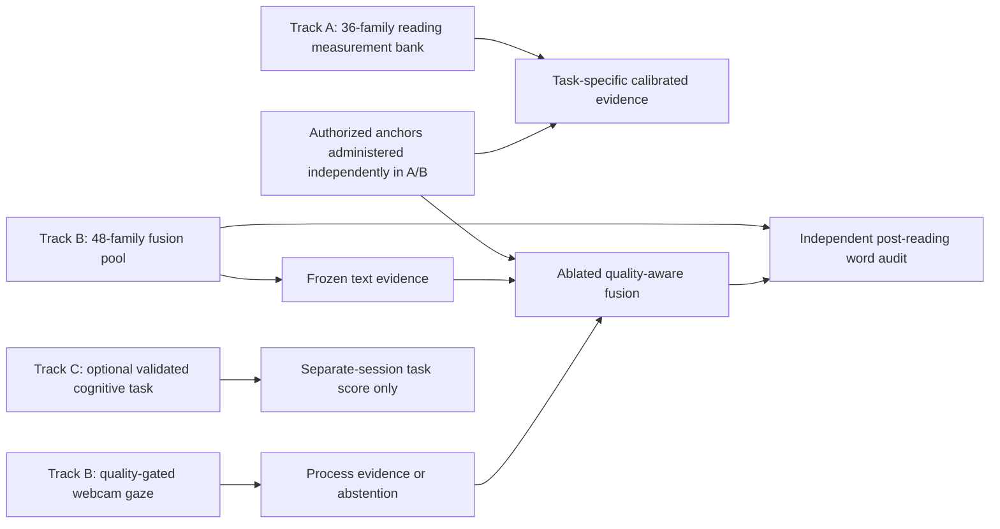

# Reader Assessment v3：測量設計與研究回顧

日期：2026-08-08

研究檢索截至：2026-08-08

狀態：設計契約已凍結；**尚未授權收案，也尚未建立任何能力量尺**。

## 結論

目前最需要改善的不是把 GPT-2 換成更大的模型，也不是替既有 theta
加更多小數位，而是修正「證據和主張不對稱」：

1. 現行文字模型有小而可重現的群體層級訊號，並非完全失效；它尚未證明能判斷
   **某個人**需要複習哪個字。
2. 目前 6 篇、18 題的題庫與專家手填 3PL 參數只能測試軟體流程，不能形成
   English proficiency、CEFR 或 cognitive profile。
3. v3 的第一產品目標改成「對未見過的讀者與文章，預測讀者事後是否想複習某字」。
   這個標籤由讀者獨立回答，不由 gaze、QA 正確率或文字模型製造。
4. 閱讀、語言背景、眼動與認知作業分開測量；不再壓成一個綜合 cognitive score。
5. 在真實題目完成校準以前，初次收案採固定、平衡的不完全區塊設計，停用未校準
   CAT。認知 add-on 另開 session，以免疲勞、順序與閱讀難度彼此污染。
6. Reading measurement calibration 與 personalized word fusion 使用不重疊 cohorts；
   重複收集更多 gaze labels 不能取代題目校準，反之亦然。

機器可讀的凍結協定在
[`reader_assessment_validity_v3.json`](reader_assessment_validity_v3.json)，其守門程式會拒絕
CEFR 提前晉級、QA 循環標籤、缺少 participant/content holdout、未校準 CAT 與把認知
作業塞回閱讀 session 等變更。

## 現有證據究竟支持什麼

| 模組 | 已有證據 | 可以說 | 還不能說 | v3 決策 |
| --- | --- | --- | --- | --- |
| 文字模型 | Provo、GECO L2 與 untouched OneStop 的方向一致；OneStop TRT 的 M1-M0 participant rho `+0.0063`、article rho `+0.0108`，5/5 folds 為正 | frozen causal surprisal 是 lexical controls 之外的小型輔助訊號 | 它能精準辨認個人困難字，或應主導 fusion | 保留 frozen artifact；不擴模型、不 fine-tune participant outcomes |
| 文字—眼動 fusion | synthetic aggregate 有改善，但 drift condition 未通過 | 可留在 shadow evaluation | 已有 production gain | 改用獨立 word-review outcome，完整 ablation 後再決定 |
| 閱讀題組 | 伺服器評分、答案不外洩、uncertainty/abstention 已做好；CPU simulation 通過工程 gate | 本次未校準題組的 session 表現 | 一般閱讀能力、English proficiency 或 CEFR | 題庫擴充與人工審題；校準期停用 CAT |
| Webcam gaze | 可輸出品質、時間與字詞層級 observables | 條件化的 session process evidence | attention、fatigue、working memory、cognitive load 或能力 | 品質不足時 abstain；只測是否提供獨立增益 |
| Cognitive profile | 目前沒有獨立且經驗證的認知作業或外部標準 | `not_estimated` | general cognition 或臨床解釋 | 改成可選、分構念、不同 session 的研究 covariates |

詳細文字模型結果見
[`2026-08-05-onestop-confirmation-run-001.md`](../experiments/2026-08-05-onestop-confirmation-run-001.md)
與
[`2026-08-06-production-text-artifact-run-001.md`](../experiments/2026-08-06-production-text-artifact-run-001.md)。

## 研究回顧帶來的設計約束

### 1. 先寫分數要做什麼，再談模型

[Standards for Educational and Psychological Testing](https://www.testingstandards.net/uploads/7/6/6/4/76643089/standards_2014edition.pdf)
將 validity 定義在「特定分數解釋與用途」，不是一個測驗本身的永久屬性；每個不同用途都要有相應證據。
[ETS 的 Evidence-Centered Design](https://www.ets.org/research/policy_research_reports/publications/report/2003/hsgs.html)
也要求依序連結 claim、需要的 evidence 與能產生該 evidence 的 task。

因此 v3 不再從現有資料反推漂亮標籤，而是先固定：

- claim：這個讀者是否可能想複習這個字；
- evidence：讀者在閱讀後、不看到模型或 gaze 結果時做的 word audit；
- task：跨文章、跨難度、已記錄抽樣機率的 sampled-word judgment；
- model：文字、person anchor、gaze 逐層加入，且每層都能單獨被否證。

### 2. 「閱讀能力」不是三種文章題型的平均

[OECD PIAAC Cycle 2 literacy framework](https://www.oecd.org/en/publications/the-assessment-frameworks-for-cycle-2-of-the-programme-for-the-international-assessment-of-adult-competencies_4bc2342d-en/full-report/component-5.html)
把成人 literacy 涵蓋 accessing、理解 literal content、跨句／跨文本 inference、評估來源與用途；其 reading components
另以 sentence verification 和 passage comprehension 的 accuracy/response time 補足基礎範圍。

因此 v3 題目藍圖由三類擴成四類：explicit、inference、lexical/cohesion、source evaluation；另設短句
meaning verification。每一類先回報 task-specific evidence，資料支持 dimensionality 之前不強壓成單一 theta。

### 3. Lexical anchor 可以很短，但不是 CEFR

[LexTALE 原始驗證研究](https://www.lextale.com/pdf/Lemhofer_Broersma_2012.pdf)
顯示約五分鐘的 lexical decision 對 advanced L2 learners 的 vocabulary knowledge 有效，且與一般 proficiency measure
相關；作者同時明確指出短 vocabulary test 不太可能精準測到 general English proficiency。
[LEAP-Q 原始研究](https://pubmed.ncbi.nlm.nih.gov/17675598/)
則支持收集語言學習史、暴露與分技能自評作為研究背景，但精準預測個別任務仍需要具體語言經驗。

所以 v3 可把經授權的 LexTALE 或等價工具當 lexical anchor，把版本化的 LEAP-Q/精簡語言背景欄位當 covariates；
兩者都不能自動轉成 CEFR。工具版本、授權與目標族群要在收案前凍結。

### 4. CEFR 是另一個完整研究計畫

[Council of Europe 的 linking manual](https://rm.coe.int/0900001680667a2d)
要求 specification、familiarisation、standardisation、standard setting，以及 internal、external 和 procedural validity
證據。對照表或與某個 placement test 的相關不能直接建立 CEFR cut scores。

因此本輪明確把 `cefr.status` 保持 `not_estimated`。若未來真的需要 CEFR，另開 protocol 和 confirmation dataset，
不從 v3 fusion 閾值順手產生。

### 5. Cognitive profile 必須由獨立作業支持

[NIH Toolbox 成人驗證研究](https://pmc.ncbi.nlm.nih.gov/articles/PMC4103959/)
把 inhibitory control、set shifting、working memory、processing speed、episodic memory、vocabulary 與 reading 分成不同作業，
並檢查 test-retest、practice effects、floor/ceiling、convergent 與 discriminant validity。
[List Sorting working-memory 研究](https://pmc.ncbi.nlm.nih.gov/articles/PMC4426848/)
也以獨立標準與 7–21 天重測來支持特定 working-memory 解釋，而不是從閱讀注視反推。

本專案若要研究 cognition，第一個 add-on 只選一個有明確理由的構念（候選為 working memory），採授權且經驗證的作業、
不同日或 counterbalanced session、alternate-form retest。結果名稱只叫「該作業表現」；不產生 general cognitive composite。
若無法取得合法工具或足夠樣本，寧可維持 `not_estimated`。

### 6. Gaze 有潛力，但一定要跨內容與跨受試者驗證

[EyeScore 原始研究](https://aclanthology.org/N18-1180/)
使用 145 位 ESL 受試者、外部 MET/TOEFL、受控 eye tracker 與文字條件特徵；預測 MET 時 fixed-text 的相關高於
any-text，且其測試切分包含整個 held-out L1 group。這說明 gaze 不是無用，而是泛化問題不能只做 random rows split。

LexiGaze 的 webcam capture 比該研究更不穩定，因此 v3 同時凍結 participant、passage family、item family、capture
session 與 device class；低品質 gaze 只讓 gaze branch abstain，不應刪除該人的文字／作答資料或輸出負面能力解釋。

### 7. Passage 題目不是互相獨立的 3PL items

共用文章刺激的題目容易有 local item dependence。[passage CAT simulation research](https://pmc.ncbi.nlm.nih.gov/articles/PMC6413677/)
顯示 passage/testlet selection 和一般 unidimensional IRT 有不同假設。v2 直接把同篇三題當獨立 3PL evidence，會讓
precision 看起來比實際樂觀。

因此 v3 初始模型限 Rasch 或 testlet Rasch，實際資料先檢查 dimensionality、local dependence 和 testlet effects；
資料證明需要且可穩定估計前，不使用 2PL/3PL，也不啟用 CAT。

## v3 實驗架構

### Track A：reading measurement calibration

- 與 fusion cohort 不重疊，Webcam gaze 不是必要資料。
- 建立新的 36-family measurement bank（18 development / 9 validation / 9 confirmation），
  每篇 4 題；現行 v2 6-passage bank 只留作 software dry run。
- Sentence verification、authorized lexical/reading anchors，以及 balanced fixed forms。
- 共通 anchor testlets 支援 forms equating；alternate form 用於預先指定的 retest subset。
- 先檢查 response process、local dependence、dimensionality 與 conditional precision，再決定是否能形成任何 reading scale。

### Track B：personalized word fusion

- 語言背景與裝置／視力情境。
- 經授權的 lexical anchor。
- Webcam 校正；品質不過只停用 gaze branch。
- 從 48 個 passage families（24 development / 12 validation / 12 confirmation）以 balanced
  incomplete-block 指派 6 篇；固定
  `16 px / 650 px / 1.7`，不 adaptive。
- 每篇讀完後抽 8 個字，回答 `no_review / unsure / review_needed`。閱讀時不標出這些字，且 UI 不顯示模型分數。
- Comprehension 題只支持 attentive-reading/session evidence，不作 fusion target 或模型選擇依據。
- 合理休息點、退出與缺漏原因。

### Track C：optional cognitive add-on

- 只從預先指定 subset 邀請，且不改變 primary fusion decision。
- 不與 Track A/B 混在同一個疲勞序列；不同日最佳，否則需 counterbalance。
- 只實作一個有研究問題的構念，不做「多做幾個小遊戲再平均」。
- 需合法授權、版本固定、獨立 scoring contract、alternate form 與重測子樣本。
- 只作 moderator/covariate；不能取代外部 English/reading anchor，也不參與 primary product gate。

## 防止 QA overfit 與資料洩漏

1. Primary outcome 是 word-review judgment；QA accuracy 明列為禁止的 training/selection target。
2. 文章、題目、候選字池與文字模型版本在人類 outcome access 前凍結。
3. Item writers 在內容 review 完成前看不到文字模型或 gaze 結果。
4. Participant、passage family、item family、capture session、device class 分別保存 group ID；同一人永遠在同一 partition。
5. 開發只能看 development；validation 只作有限選擇；confirmation 僅開一次且不能重調閾值。
6. 必須報告 participant-only、passage-only、joint participant+passage、capture-heldout，以及樣本足夠時的 device-heldout cell。
7. Word probes 的抽樣機率要保存，避免只在模型自認最難的字上報成效。
8. v3 protocol、內容銀行與 split manifest 凍結前已收集的 session 不丟棄，但只能作
   workflow、資料品質與 exploratory evidence；不得進入 item calibration、threshold selection、
   validation 或 confirmation，並保持獨立 provenance。

## 模型比較與晉級規則

固定 ablation ladder：

1. `B0` training prevalence；
2. `B1` length/frequency/position；
3. `B2` 現行 frozen GPT-2 surprisal artifact；
4. `B3` external anchor + language background；
5. `B4` quality-gated gaze-only；
6. `F1` text + person；
7. `F2` text + person + gaze quality/missingness。

Primary metric 是三類 outcome 的 mean negative log-likelihood；另報 ranked probability score、multiclass Brier、
calibration 與不同 abstention coverage。`F2` 只有在 joint participant+passage confirmation 優於每個 eligible comparator、
multiway resampling interval 排除零、其他 holdout 不反向、校準不變差且 gaze 缺漏可安全退回 `F1` 時才可晉級。
實用效益的最小門檻必須在 confirmation 前用產品成本模擬凍結，不能看結果後決定「多少算有用」。

## 收案與樣本規劃

- Dress rehearsal：5–8 人，只修流程、文案、計時與缺漏，不估效果。
- Feasibility pilot：20–40 人，只看 development partition 的完成率、分布、品質與訪談；不得拿來宣告量尺有效。
- Track A calibration：不要用「有幾位朋友就先 fit 3PL」。measurement bank 凍結後，另以 CPU simulation
  檢查 item/testlet parameter precision、equating、DIF cells 與 attrition。
- Track B fusion：assignment coverage 已以 200 replicates 比較 `n=300/600/900`。18-family 方案只有 3 個
  confirmation passage clusters，故否決；48-family 方案保留 12 個。即使 `n=600` 有中位 1,440 個 joint
  confirmation word labels，每篇 joint cell 的第五百分位仍僅 6 人，因此 600 不能被當成「已足夠」。詳見
  [`validity_v3_fusion_coverage_run_001.md`](experiments/validity_v3_fusion_coverage_run_001.md)。
- 最終 Track A 與 Track B 的 n 分別依 item precision 與 cluster-aware effect/utility power 凍結，不共用一個數字。
- Alternate-form retest：由正式樣本中預先指定子樣本與間隔；練習效應和流失都要報告。

上述人數區間是規劃節點，不是 validity 門檻。若只能取得少量朋友資料，它們仍非常適合 dress rehearsal 和
response-process interview，但不能拿來校準能力標籤。

## 已凍結與仍待決定

已凍結：

- primary product outcome 與禁止的循環 targets；
- Track A/B 分開且 participant cohorts 不重疊；
- fixed-form calibration、固定 typography、36-family measurement bank 與 48/6/8 fusion matrix；
- 五個 holdout axes、單次 confirmation、模型 ablation；
- cognition separate session、no composite、current phase CPU-only。

收案前仍需完成：

- 修訂倫理／exempt determination、同意書、保存與撤回文件；
- lexical/reading anchors 的工具選擇與授權；
- Track A 的 36 passage families / 144 comprehension items，以及 Track B 的 48-family
  fusion pool / word-probe candidate pool 的雙人 review；
- balanced assignment manifest 與 simulation-based sample size；
- primary practical-utility threshold；
- end-to-end dress rehearsal。

這個界線是刻意的：v3 現在已能阻止錯誤研究設計進入收案，但還不假裝「一份 JSON 就完成了效度」。
